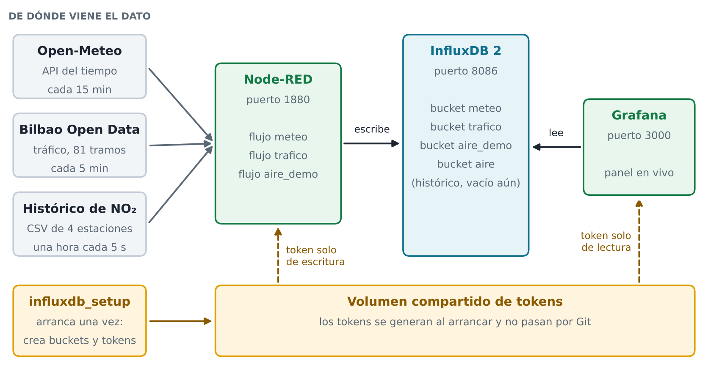

# HaizeLab: Monitorizacion y Analisis Multivariable de la ZBE de Bilbao

> Evaluacion de impacto de la Zona de Bajas Emisiones (ZBE) en la calidad del aire de Bilbao (2022-2026).
> Proyecto desarrollado por el equipo Haizen Lab (Alfred, Inigo y Kerman) para el Reto 0 (SBD, MIA, BDA y PIA).

---

## 1. Resumen y objetivos del proyecto

La Zona de Bajas Emisiones (ZBE) de Bilbao comenzo a operar en el distrito de Abando el 15 de junio de 2024 (Fase 1: restriccion a vehiculos sin distintivo ambiental de la DGT) y el 16 de junio de 2025 (Fase 2: restriccion a vehiculos con distintivo B para no residentes), en horario de lunes a viernes de 7:00 a 20:00.

El objetivo del proyecto es responder con rigor analitico a la pregunta del Ayuntamiento de Bilbao: ¿ha reducido la ZBE los niveles de dioxido de nitrogeno (NO2) en el centro de la ciudad de forma atribuible a las restricciones de trafico?

Para resolver este problema, el repositorio integra dos componentes complementarios:
1. **Infraestructura de datos en tiempo real (BDA)**: Ingesta de fuentes publicas mediante Node-RED, almacenamiento en series temporales con InfluxDB 2.9 y cuadros de mando interactivos con control de acceso por roles en Grafana 11.2.
2. **Pipeline de analisis analitico y econometrico (SBD)**: Control por meteorologia (Open-Meteo), modelo cuasiexperimental de Diferencias en Diferencias (Diff-in-Diff) frente a estaciones de control metropolitano y contraste con aforos de trafico de accesos y circunvalacion.

---

## 2. Arquitectura del sistema

```
                  +----------------------------------------------+
                  |                   FUENTES                    |
                  +-------+--------------+--------------+--------+
                          |              |              |
                    Open-Meteo API   Bilbao Open Data  Historico NO2
                    (cada 15 min)     (cada 5 min)     (Demo acelerada)
                          |              |              |
                          v              v              v
                  +----------------------------------------------+
                  |                   Node-RED                   |
                  |             (http://localhost:1880)          |
                  |   Flujos: meteo | trafico | aire_demo        |
                  +----------------------+-----------------------+
                                         | Token: nodered-write
                                         v
                  +----------------------------------------------+
                  |                  InfluxDB 2                  |
                  |             (http://localhost:8086)          |
                  |   Buckets: aire, meteo, trafico, aire_demo   |
                  +----------------------+-----------------------+
                                         | Token: read-all
                                         v
                  +----------------------------------------------+
                  |                   Grafana                    |
                  |             (http://localhost:3000)          |
                  |   Dashboards, alertas y control de acceso    |
                  +----------------------------------------------+
```



---

## 3. Estructura del repositorio

```
haizelab/
|-- data/                              # Directorio de trabajo del modulo SBD
|   |-- raw/                           # Datos brutos descargados de fuentes abiertas
|   `-- clean/                         # Datasets limpios e integrados para el notebook
|       |-- calendario_zbe_limpio.csv  # Calendario laboral, horario y festivos de Bilbao
|       |-- calidad_aire_limpio.csv    # Serie horaria saneada de NO2 y contaminantes
|       |-- meteorologia_limpia.csv    # Serie meteorologica horaria de Bilbao
|       `-- dataset_integrado_zbe.csv  # Dataset maestro unificado tras operaciones de JOIN
|
|-- datos/                             # Datos historicos organizados por tematica
|   |-- crudo/                         # Copias de trabajo locales
|   `-- procesados/                    # Datasets particionados y comprimidos para Git
|       |-- calidad_aire/              # Inventario y serie comprimida no2_horario_limpio.zip
|       |-- meteorologia/              # Resumenes y serie horaria de Bilbao
|       |-- trafico/                   # Series de aforos de accesos y circunvalacion
|       `-- unificados/                # Tablas de sintesis ejecutiva y regresiones
|
|-- docs/                              # Documentacion tecnica e informes
|   |-- img/                           # Graficas analiticas y capturas de servicios
|   |-- informe-cliente-sbd.md         # Informe ejecutivo para el cliente (maximo 4 paginas)
|   |-- infraestructura-explicada.md   # Justificacion tecnica de InfluxDB, Node-RED y Grafana
|   |-- organigrama-datos.md           # Esquema org, buckets, measurements, fields y tags
|   |-- propuesta-modelo-ia.md         # Propuesta tecnica de modelo de IA (Reto 0 - Modulo MIA)
|   `-- MIA_Haizen_Lab.pdf             # Documento oficial de entrega en formato PDF (MIA)
|
|-- grafana/                           # Servicio de cuadros de mando y alertas
|   |-- dashboards/
|   |   `-- haizelab-overview.json     # Dashboard auto-provisionado de la ZBE
|   |-- provisioning/
|   |   |-- access-control/setup-access.sh # Configuracion de equipos y usuarios por API
|   |   |-- alerting/alerting.yaml     # Reglas de alerta oficiales OMS y UE
|   |   `-- dashboards/dashboards.yaml # Proveedor automatico de dashboards
|   `-- entrypoint.sh                  # Inyeccion de token read-all en arranque
|
|-- influxdb/                          # Base de datos de series temporales
|   `-- init-influxdb.sh               # Creacion automatica de buckets y tokens
|
|-- ingesta/                           # Modulos de adquisicion y carga
|   |-- carga_historica.py             # Carga masiva a InfluxDB mediante Line Protocol
|   |-- descargar_y_limpiar.py         # Pipeline reproducible de ETL del modulo SBD
|   `-- no2_demo_reducido.csv          # Muestra historica para reproduccion acelerada
|
|-- notebooks/                         # Analisis interactivo reproducible
|   `-- zbe_bilbao.ipynb               # Cuaderno Jupyter con EDA, Diff-in-Diff y conclusiones
|
|-- salida/                            # Graficos exportados de alta resolucion
|   |-- dashboard_decision_zbe.png     # Panel de decision ejecutiva (4 cuadrantes)
|   `-- evolucion_mensual_no2.png      # Comparativa mensual dentro vs. fuera de la ZBE
|
|-- scripts/                           # Scripts modulares de soporte analitico
|   |-- 01_extraer_calidad_aire.py     # ETL de calidad de aire
|   |-- 02_extraer_meteorologia.py     # ETL de meteorologia
|   |-- 03_extraer_trafico.py          # ETL de aforos de trafico
|   |-- 04_unificar_datos.py           # Cruce y alineamiento espaciotemporal
|   |-- 05_analisis_impacto_zbe.py     # Estimacion del modelo Diff-in-Diff
|   |-- 06_visualizar_decision.py      # Generacion de graficas ejecutivas
|   `-- generar_informe_docx.py        # Generador del informe Word en Arial 11 (4 paginas)
|
|-- .env.example                       # Plantilla de variables de entorno segura
|-- Dockerfile                         # Entorno de ejecucion reproducible Python 3.11
|-- docker-compose.yml                 # Orquestacion multicontenedor completa
`-- requirements.txt                   # Dependencias de Python
```

---

## 4. Guia de puesta en marcha

### Paso 1: Clonar el repositorio y situarse en la rama de trabajo
```bash
git clone https://github.com/ai-somorrostro/haizelab.git
cd haizelab
git checkout develop
```

### Paso 2: Configurar las variables de entorno
Copiar el fichero de ejemplo:
```bash
cp .env.example .env
```
Los valores por defecto permiten arrancar directamente en local de forma segura.

### Paso 3: Arrancar los contenedores
Construir y levantar los servicios en segundo plano:
```bash
docker compose up -d --build
```

### Paso 4: Comprobar el estado de los servicios
Esperar entre 25 y 40 segundos a que InfluxDB y Grafana completen sus comprobaciones de salud:
```bash
docker compose ps
```
Los cuatro servicios deben encontrarse en estado saludable (`Up` o `healthy`):
* `haizelab_influxdb`: puerto `8086`
* `haizelab_influxdb_setup`: finalizado correctamente con codigo `0`
* `haizelab_nodered`: puerto `1880`
* `haizelab_grafana`: puerto `3000`

---

## 5. Acceso a los servicios y credenciales

Todos los puertos quedan expuestos exclusivamente en `127.0.0.1`:

| Servicio | URL Local | Usuario | Clave | Descripcion |
|---|---|---|---|---|
| Grafana | http://localhost:3000 | Usuarios de equipo | Ver tabla de roles | Cuadro de mando y alertas |
| Node-RED | http://localhost:1880 | Libre en local | - | Gestion de flujos de ingesta |
| InfluxDB | http://localhost:8086 | admin | Segun `INFLUXDB_ADMIN_PASSWORD` | Explorador de datos y tokens |

---

## 6. Control de acceso y roles en Grafana

Para dar respuesta a los requerimientos departamentales solicitados por la direccion, se aprovisionan tres equipos diferenciados:

| Equipo | Usuarios de prueba | Clave | Rol en Grafana | Permisos asignados |
|---|---|---|---|---|
| Cupula Directiva | `directora` | `haize2024dir` | Viewer | Visualiza todos los paneles, sin permisos de modificacion |
| Equipo Analisis | `analista1` a `analista6` | `haize2024a1` .. `a6` | Viewer | Acceso de visualizacion a sus paneles asignados |
| Equipo IT | `it_admin1` (Admin), `it_admin2`, `it_admin3` (Editor) | `haize2024it1` .. `it3` | Admin / Editor | Permiso total para editar paneles, datasources y alertas |

---

## 7. Flujos de ingesta en Node-RED

En http://localhost:1880 se encuentran tres flujos automatizados:
1. **meteo (cada 15 minutos)**: Consulta la API de Open-Meteo (Bilbao), procesa variables ambientales y escribe en el bucket `meteo`.
2. **trafico (cada 5 minutos)**: Consulta el servicio GeoJSON de Bilbao Open Data (81 tramos), filtra valores anomalos y escribe en el bucket `trafico`.
3. **aire_demo (cada 5 segundos)**: Emite en streaming acelerado los datos horarios de cuatro estaciones estrategicas (Mazarredo, Maria Diaz de Haro, Europa y Arraiz) para demostraciones en vivo.

---

## 8. InfluxDB 2: Buckets y tokens de acceso

El contenedor inicial `influxdb_setup` genera los buckets con sus politicas de retencion y los tokens de minimo privilegio:

| Bucket | Retencion | Descripcion | Measurement |
|---|---|---|---|
| `aire` | Infinita | Serie historica oficial de contaminantes (2022-2026) | `contaminantes` |
| `meteo` | Infinita | Meteorologia historica y datos en tiempo real | `clima` |
| `trafico` | 30 dias | Intensidad, ocupacion y velocidad de 81 tramos | `estado` |
| `aire_demo` | 7 dias | Datos acelerados para la prueba en vivo | `contaminantes` |

### Tokens segregados:
* `nodered-write`: Escritura permitida exclusivamente en `meteo`, `trafico` y `aire_demo`. No tiene permisos en `aire`.
* `batch-write`: Escritura para scripts de carga masiva en `aire` y `meteo`.
* `read-all`: Lectura sobre los 4 buckets para cuadros de mando (Grafana).
* `mcp-read-only` (`INFLUXDB_MCP_TOKEN`): Lectura sobre los 4 buckets solo para el servidor MCP (`influx-mcp`). Autogenerado por `influxdb_setup`.
* `admin`: Restringido exclusivamente al aprovisionamiento interno del sistema.

---

## 9. Pipeline de analisis del modulo SBD

### Opcion A: Ejecucion dentro de Docker (Recomendada)
```bash
# Descarga, control de calidad e integracion de datos
docker compose run --rm sbd-pipeline

# Ejecucion automatica del notebook completo
docker compose run --rm sbd-notebook
```

### Opcion B: Ejecucion en entorno local
Instalacion de librerias:
```bash
pip install -r requirements.txt
```

Ejecucion del pipeline:
```bash
# 1. Ingesta, limpieza y construccion del dataset integrado
python ingesta/descargar_y_limpiar.py

# 2. Carga historica en InfluxDB (opcional)
python ingesta/carga_historica.py --bucket all

# 3. Generacion del informe impreso en Word (4 paginas en Arial 11)
python scripts/generar_informe_docx.py
```

---

## 10. Resultados principales de la evaluacion de la ZBE

El analisis econometrico realizado a partir del diseno unificado de 8 estaciones (2 dentro: Mazarredo y Maria Diaz de Haro; 5 de control metropolitano del Gran Bilbao: Europa, Barakaldo, Basauri, Erandio, Castrejana; y 1 de fondo: Monte Arraiz) arroja los siguientes resultados consensuados:

1. **Reduccion real de NO2 y estimador causal neto**:
   * Dentro de la ZBE: descenso de **25,50 a 21,90 ug/m3** (**-3,59 ug/m3**, o **-14,08%** bruto antes/despues).
   * En estaciones de control exterior (Gran Bilbao): descenso de **18,25 a 16,29 ug/m3** (**-1,96 ug/m3**, o **-10,75%**).
   * **Efecto neto causal (Diff-in-Diff)**: reduccion neta atribuible a la ZBE de **-1,63 ug/m3** (error estandar 0,12; p-valor < 0,001), equivalente a un **-6,39% (~ -6,4%)** sobre la linea de base interior de 25,5 ug/m3. El titular causal solido es este -6,4% y no el -14% bruto, dado que mas de la mitad del descenso ocurrio tambien en el resto de la metropolis por meteorologia y renovacion vehicular.
2. **Control meteorologico por regimen de viento**:
   * En situaciones de calma atmosferica (< 2 m/s, baja dispersion), el NO2 interior paso de 28,10 ug/m3 a 25,47 ug/m3 en Fase 1 (**-9,4%**) y a 23,56 ug/m3 en Fase 2 (**-16,2%**), con una media post global de 24,35 ug/m3 (**-13,4%**). Esto confirma que en los momentos de mayor peligro sanitario el aire esta significativamente mas limpio.
3. **Contraste con volumenes de trafico (San Mames) y control placebo**:
   * En 2024 (Fase 1), el acceso de San Mames mostro una disuasion inicial del **-10,12%** (-5.075 vehiculos/dia).
   * En 2025 (Fase 2), se registro un rebote a 48.543 vehiculos/dia (+7,75% interanual), situando la caida neta 2023–2025 en un **-3,16%** (~ -3,2%). Presentar la serie completa evita sesgos de seleccion (cherry-picking) y evidencia una adaptacion progresiva de los conductores.
   * **Control placebo de SO2**: la variacion neta en Diff-in-Diff del dioxido de azufre fue de **+0,33 ug/m3** (-3,94% bruto dentro), validando que las mejoras son atribuibles especificamente al trafico fósil y no a dinamicas industriales o portuarias.
4. **Veredicto institucional y limitaciones tecnicas asumidas**:
   * **Veredicto:** *Efecto reductor confirmado pero moderado*.
   * Se asumen con total honestidad cientifica cinco limitaciones tecnicas: (1) representatividad espacial acotada a 2 estaciones interiores, (2) magnitud absoluta moderada (-1,63 ug/m3) frente a la variabilidad climatica, (3) normalizacion post-pandemia en la base previa (2022-2023), (4) factores concurrentes (renovacion de la flota y descuentos en transporte publico), y (5) concentraciones ambientales medidas en sensores vs. emisiones directas en tubo de escape.

---

## 11. Autores, Roles Scrum y Entregables del Reto

Proyecto desarrollado por el equipo **Haizen Lab** para el Reto 0 («HERE WE GO») del Centro de Formacion Somorrostro:
* **Alfred Gabriel** (Product Owner / PIA): Arquitectura Docker Compose, servicio MCP, orquestación del pipeline y control de versiones mediante Git Feature Branching.
* **Iñigo Bilbao** (Scrum Master / MIA): Diseño del modelo predictivo contrafactual de Machine Learning (HistGradientBoosting), validación temporal, tests de placebo y memoria MIA.
* **Kerman Irusta** (Lead Data Engineer / BDA): Flujos Node-RED en tiempo real, gestión de series temporales en InfluxDB 2.9 (4 tokens de seguridad), dashboards y control de acceso RBAC en Grafana 11.2.

### Entregables Oficiales Disponibles en el Repositorio
* **SBD (Informe Ejecutivo Impreso en Arial 11, máx. 4 páginas de cuerpo)**:
  * Documento Word editable: [`docs/Informe_Ejecutivo_ZBE_Bilbao_HaizeLab.docx`](docs/Informe_Ejecutivo_ZBE_Bilbao_HaizeLab.docx)
  * Documento PDF oficial compilado: [`docs/Informe_Ejecutivo_ZBE_Bilbao_HaizeLab.pdf`](docs/Informe_Ejecutivo_ZBE_Bilbao_HaizeLab.pdf)
  * Cuaderno reproducible ejecutado: [`notebooks/zbe_bilbao.ipynb`](notebooks/zbe_bilbao.ipynb)
* **MIA (Memoria de Modelos de IA)**:
  * Memoria PDF oficial: [`docs/MIA_Haizen_Lab.pdf`](docs/MIA_Haizen_Lab.pdf)
  * Propuesta detallada en Markdown: [`docs/propuesta-modelo-ia.md`](docs/propuesta-modelo-ia.md)
* **BDA (Infraestructura de Datos y Series Temporales)**:
  * Organigrama de datos y capturas de pantalla: [`docs/organigrama-datos.md`](docs/organigrama-datos.md)
  * Flujos de Node-RED exportados: [`nodered/flows.json`](nodered/flows.json)
  * Dashboards de Grafana aprovisionados: [`grafana/dashboards/haizelab-overview.json`](grafana/dashboards/haizelab-overview.json) y [`grafana/dashboards/haizelab-analisis-zbe.json`](grafana/dashboards/haizelab-analisis-zbe.json)
* **PIA (Contenerización, Código y MCP)**:
  * Orquestación de servicios: [`docker-compose.yml`](docker-compose.yml)
  * Servidor MCP solo lectura: [`mcp/`](mcp/) e interfaz JSON-RPC en puerto 5001.
