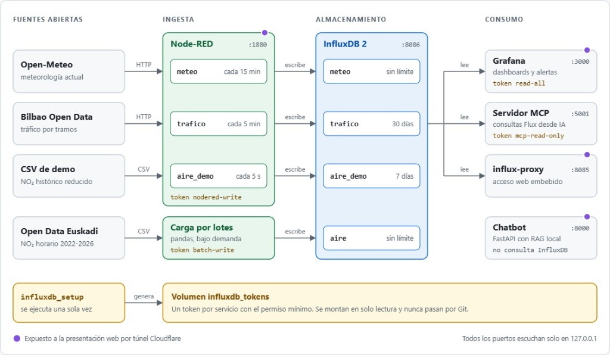

# HaizeLab

Evaluación del efecto de la Zona de Bajas Emisiones (ZBE) de Bilbao sobre la concentración de NO₂, con datos horarios de 2022 a 2026, y plataforma de monitorización en tiempo real construida con Node-RED, InfluxDB y Grafana.

Proyecto del Reto 0 "HERE WE GO" del Centro de Formación Somorrostro, curso de especialización en Inteligencia Artificial y Big Data.

## Contenido

- [Resultado](#resultado)
- [Arquitectura](#arquitectura)
- [Puesta en marcha](#puesta-en-marcha)
- [Carga del histórico](#carga-del-histórico)
- [Pipeline analítico](#pipeline-analítico)
- [Grafana: usuarios, roles y alertas](#grafana-usuarios-roles-y-alertas)
- [Servidor MCP](#servidor-mcp)
- [Asistente inteligente (Chatbot)](#asistente-inteligente-chatbot)
- [Presentación web](#presentación-web)
- [Estructura del repositorio](#estructura-del-repositorio)
- [Documentación](#documentación)
- [Flujo de trabajo](#flujo-de-trabajo)
- [Equipo](#equipo)

## Resultado

La pregunta del cliente es si la ZBE ha reducido el NO₂ en el centro más de lo que ha bajado en el resto del área metropolitana. Se responde con un diseño de diferencias en diferencias (DiD): dos estaciones dentro del perímetro frente a cinco estaciones de control fuera, antes y después del 15 de junio de 2024.

| Indicador | Antes | Después | Variación |
|---|---:|---:|---:|
| NO₂ dentro de la ZBE (Mazarredo y Mª Díaz de Haro) | 25,50 µg/m³ | 21,90 µg/m³ | -3,59 µg/m³ (-14,1 %) |
| NO₂ en las estaciones de control (Gran Bilbao) | 18,25 µg/m³ | 16,29 µg/m³ | -1,96 µg/m³ (-10,8 %) |
| **Efecto neto atribuible a la ZBE (DiD)** | | | **-1,63 µg/m³ (-6,4 %)** |

El estimador DiD tiene un intervalo de confianza al 95 % de -1,87 a -1,39 µg/m³ (p < 0,001). Tres comprobaciones lo acompañan:

| Comprobación | Resultado | Qué descarta |
|---|---|---|
| Regresión con controles de meteorología y mes | -1,74 µg/m³ | Que el efecto se deba a un periodo posterior más ventoso o lluvioso |
| Horas de calma (viento inferior a 2 m/s), dentro de la ZBE | De 28,10 a 25,47 µg/m³ en la fase 1 (-9,4 %) y a 23,56 µg/m³ en la fase 2 (-16,2 %) | Que la mejora dependa de la ventilación |
| Placebo con SO₂, que no procede del tráfico | DiD de +0,33 µg/m³ | Que cualquier contaminante baje más dentro que fuera |

El aforo del acceso de San Mamés pasó de 50.127 vehículos al día en 2023 a 45.052 en 2024 (-10,1 %) y repuntó a 48.543 en 2025, un 3,2 % por debajo de 2023.

La conclusión es un efecto confirmado pero moderado: algo más de la mitad de la bajada observada en el centro se habría producido igualmente, porque también bajó fuera. Limitaciones que hay que tener presentes al leer las cifras:

- Solo hay dos estaciones oficiales dentro del perímetro.
- Se miden concentraciones en el aire, no emisiones de los vehículos.
- Coinciden otros cambios en el mismo periodo, como la renovación del parque móvil.

El desarrollo completo está en el [informe para el cliente](docs/informe-cliente-sbd.md) y en el [notebook](notebooks/zbe_bilbao.ipynb). Las cifras de esta sección salen de la ejecución de ese notebook sobre 332.776 registros horarios de ocho estaciones.

## Arquitectura

<picture>
  
</picture>

Las flechas siguen el sentido del dato. Cada flujo de Node-RED escribe en su propio bucket y ningún servicio de consumo puede escribir. Junto a cada bucket aparece su retención.

### Servicios

Todo se levanta con Docker Compose. Los puertos se publican solo en `127.0.0.1`.

| Servicio | Imagen | Puerto | Función |
|---|---|---:|---|
| `influxdb` | `influxdb:2.9.1` | 8086 | Base de datos de series temporales |
| `influxdb_setup` | `influxdb:2.9.1` | | Contenedor efímero que crea los buckets y los tokens en el primer arranque |
| `nodered` | `nodered/node-red:5.0.7` con `node-red-contrib-influxdb` 0.7.0 | 1880 | Ingesta continua de meteorología, tráfico y demo de NO₂ |
| `grafana` | `grafana/grafana:11.2.0` | 3000 | Dashboards, alertas y control de acceso |
| `influx-mcp` | `python:3.12-slim` con `influxdb-mcp` | 5001 | Servidor MCP de solo lectura (requisito PIA) |
| `chatbot` | `python:3.11-slim` con FastAPI | 8000 | Asistente inteligente explicable con base de conocimiento local |
| `presentacion` | `nginx:alpine` | 8080 | Diapositivas interactivas con dashboards embebidos |

### Buckets

| Bucket | Measurement | Retención | Quién escribe |
|---|---|---|---|
| `aire` | `contaminantes` | Sin límite | Carga por lotes con pandas |
| `meteo` | `clima` | Sin límite | Node-RED cada 15 minutos y carga por lotes del histórico |
| `trafico` | `estado` | 30 días | Node-RED cada 5 minutos |
| `aire_demo` | `contaminantes` | 7 días | Node-RED cada 5 segundos, reproduciendo el histórico |

El detalle de tags y fields está en el [organigrama de datos](docs/organigrama-datos.md).

### Tokens

El script [`influxdb/init-influxdb.sh`](influxdb/init-influxdb.sh), ejecutado por el contenedor `influxdb_setup`, genera automáticamente los cuatro tokens con el principio de mínimo privilegio y los deposita en el volumen compartido `influxdb_tokens`. **No es necesario crear ningún token a mano en la interfaz de InfluxDB**, ya que los servicios los consumen directamente del volumen en solo lectura. Ningún token se guarda en el repositorio.

| Token | Permiso | Lo usa |
|---|---|---|
| `nodered-write` | Escritura en `meteo`, `trafico` y `aire_demo` | Node-RED |
| `batch-write` | Escritura en `aire` y `meteo` | `ingesta/carga_historica.py` |
| `read-all` | Lectura de los cuatro buckets | Grafana |
| `mcp-read-only` | Lectura de los cuatro buckets | Servidor MCP |

## Puesta en marcha

Requisito: Docker con Compose v2.

**1. Clonar el repositorio y crear el fichero de entorno.** En una terminal:

```bash
git clone https://github.com/ai-somorrostro/haizelab.git
cd haizelab
git switch develop
cp .env.example .env
```

**2. Editar `.env`** y sustituir los cinco valores de ejemplo. El fichero está en `.gitignore` y no debe subirse.

| Variable | Para qué sirve |
|---|---|
| `INFLUXDB_ADMIN_PASSWORD` | Contraseña del administrador de InfluxDB y de Grafana |
| `INFLUXDB_ADMIN_TOKEN` | Token de administración de InfluxDB, usado solo por `influxdb_setup` |
| `NODE_RED_CREDENTIAL_SECRET` | Clave con la que Node-RED cifra sus credenciales |
| `NODE_RED_ADMIN_PASSWORD` | Contraseña del editor de Node-RED |
| `GRAFANA_DEFAULT_PASSWORD` | Base de las contraseñas de los usuarios de Grafana |
| `GEMINI_API_KEY` *(Opcional)* | Clave gratuita de Google Gemini para activar el razonamiento con IA del chatbot |

Para generar un valor aleatorio:

```bash
openssl rand -hex 32
```

**3. Levantar la plataforma.**

```bash
docker compose up -d --build
```

Durante el primer arranque, el contenedor efímero `haizelab_influxdb_setup` ejecuta automáticamente [`influxdb/init-influxdb.sh`](influxdb/init-influxdb.sh), creando los buckets adicionales (`meteo`, `trafico`, `aire_demo`) y aprovisionando los cuatro tokens con sus permisos mínimos.

> **Nota:** Si en algún momento necesitas verificar o regenerar los buckets y tokens manualmente (por ejemplo, tras modificar retenciones en `.env` sin reiniciar los volúmenes), puedes invocar el script directamente con:
> ```bash
> docker compose run --rm influxdb_setup
> ```

**4. Comprobar el estado.**

```bash
docker compose ps -a
```

`haizelab_influxdb_setup` debe aparecer como `Exited (0)` y el resto de contenedores como `healthy`.

| Servicio | Dirección |
|---|---|
| Presentación interactiva | http://localhost:8080 |
| Grafana | http://localhost:3000 |
| Node-RED | http://localhost:1880 |
| InfluxDB | http://localhost:8086 |
| Servidor MCP | http://127.0.0.1:5001/mcp/ |
| Chatbot (API / Docs) | http://localhost:8000/docs |

Para detener la plataforma conservando los datos:

```bash
docker compose down
```

Para detenerla borrando también los datos y los tokens:

```bash
docker compose down -v
```

## Carga del histórico

Tras el primer arranque, `aire_demo`, `meteo` y `trafico` empiezan a recibir datos por Node-RED. El bucket `aire`, con el histórico oficial de NO₂, se rellena una vez con el script de carga.

**1. Consultar el token de escritura por lotes (opcional).** `init-influxdb.sh` ya generó el token `batch-write` en el volumen de Docker. Si ejecutas la carga desde el host (fuera de Docker) y quieres usar este token restringido en vez del de administración, puedes leerlo con:

```bash
docker run --rm -v haizelab_influxdb_tokens:/tokens:ro alpine grep '^INFLUXDB_BATCH_WRITE_TOKEN=' /tokens/tokens.env
```

Copia la línea obtenida al final de tu `.env`. Si no se añade, el script recurre de forma transparente al token de administración (`INFLUXDB_ADMIN_TOKEN`).

El prefijo `haizelab_` del volumen es el nombre de la carpeta del proyecto. Si la carpeta se llama de otra forma, hay que cambiarlo.

**2. Instalar las dependencias y validar sin escribir.**

```bash
pip install -r requirements.txt
python ingesta/carga_historica.py --bucket all --dry-run
```

**3. Cargar.**

```bash
python ingesta/carga_historica.py --bucket all
```

## Pipeline analítico

El repositorio contiene dos recorridos sobre los mismos datos de origen. El primero es el entregable del módulo de Sistemas de Big Data y es el que produce las cifras de la sección [Resultado](#resultado).

| Recorrido | Código | Datos | Salida |
|---|---|---|---|
| Ingesta reproducible y notebook | `ingesta/descargar_y_limpiar.py` y `notebooks/zbe_bilbao.ipynb` | `data/` | Figuras en `docs/img/` |
| Scripts numerados | `scripts/01` a `scripts/06` | `datos/` | Figuras en `salida/` |

Para reproducir el primero, que descarga los datos de Open Data Euskadi y Open-Meteo y ejecuta el notebook:

```bash
docker compose run --rm sbd-pipeline
docker compose run --rm sbd-notebook
```

Los scripts numerados siguen este orden:

| Paso | Script | Qué hace |
|---:|---|---|
| 1 | `01_extraer_calidad_aire.py` | Limpia el NO₂ horario y clasifica cada estación como dentro, fuera o fondo |
| 2 | `02_extraer_meteorologia.py` | Normaliza la serie meteorológica horaria |
| 3 | `03_extraer_trafico.py` | Extrae los aforos de las memorias de la Diputación Foral de Bizkaia |
| 4 | `04_unificar_datos.py` | Cruza aire, meteorología y tráfico por hora |
| 5 | `05_analisis_impacto_zbe.py` | Calcula el DiD y el análisis por régimen de viento |
| 6 | `06_visualizar_decision.py` | Genera el panel de decisión |

Los pasos 1 a 3 leen de `datos/crudo/`, que no está versionado por tamaño. Los pasos 4 a 6 funcionan con los datos procesados que sí están en el repositorio:

```bash
docker compose run --rm analisis
docker compose run --rm visualizar
```

## Grafana: usuarios, roles y alertas

Los usuarios, los equipos y la página de inicio de cada equipo se crean al arrancar mediante `grafana/provisioning/access-control/setup-access.sh`. Las contraseñas se derivan de `GRAFANA_DEFAULT_PASSWORD`.

| Equipo | Usuarios | Rol | Página de inicio |
|---|---|---|---|
| Dirección | `directora` | Viewer | Monitor ZBE en tiempo real (`haizelab-overview`) |
| Análisis | `analista1` a `analista6` | Viewer | Panel de análisis ZBE (`haizelab-analisis`) |
| IT | `it_admin1` | Admin | La predeterminada |
| IT | `it_admin2` y `it_admin3` | Editor | La predeterminada |

El administrador de Grafana usa el usuario y la contraseña de `INFLUXDB_ADMIN_USER` e `INFLUXDB_ADMIN_PASSWORD`. El editor de Node-RED usa `NODE_RED_ADMIN_USER` y `NODE_RED_ADMIN_PASSWORD`.

Las alertas se aprovisionan desde `grafana/provisioning/alerting/alerting.yaml`:

| Alerta | Umbral | Referencia |
|---|---|---|
| NO₂, aviso | Más de 25 µg/m³ | Guía de la OMS de 2021 |
| NO₂, superación | Más de 40 µg/m³ | Límite anual de la UE |
| NO₂, pico horario | Más de 200 µg/m³ | Límite horario de la UE |
| Tráfico, congestión | Ocupación media superior al 35 % | Criterio propio |

## Servidor MCP

El servicio `influx-mcp` expone InfluxDB a clientes compatibles con Model Context Protocol en `http://127.0.0.1:5001/mcp/`, con un token que solo permite leer. Ofrece cuatro herramientas: `test_connection`, `list_buckets`, `list_measurements` y `execute_flux_query`.

La configuración de los clientes OpenCode y Antigravity ya está en `opencode.json` y `.agents/mcp_config.json`. La instalación, la verificación y la resolución de problemas están en [mcp/README.md](mcp/README.md).

## Asistente inteligente (Chatbot)

El servicio `chatbot` (`http://localhost:8000`) proporciona una API en FastAPI diseñada para responder consultas técnicas sobre el estudio de la ZBE de Bilbao, métricas DiD, tráfico, clima y arquitectura.

### Modalidades de funcionamiento:

1. **Modo Offline (Por defecto):**
   * No requiere ninguna clave ni configuración adicional.
   * Responde de forma instantánea y determinista utilizando los datos oficiales de `knowledge_base.json`.
   * Garantiza que el asistente siempre funcione en cualquier equipo sin internet.

2. **Modo Razonamiento con IA en vivo (Opcional):**
   * Si quieres que el asistente genere lenguaje natural dinámico, razone hipótesis (*«¿Por qué el SO₂ no bajó?»*) y argumente los porqués:
     1. Obtén una clave API gratuita en [Google AI Studio](https://aistudio.google.com/) *(se genera en 10 segundos con tu cuenta de Gmail, gratis y sin tarjeta)*.
     2. Añádela a tu archivo `.env`:
        ```env
        GEMINI_API_KEY=AIzaSy_tu_clave_aqui
        ```
     3. Reinicia el contenedor del chatbot:
        ```bash
        docker compose up -d chatbot
        ```
     * *(Alternativa local)*: Si prefieres no usar la nube, abre **Ollama** en tu ordenador (`ollama run qwen2.5:1.5b`); el contenedor lo detecta automáticamente sin necesidad de claves.

La documentación interactiva de la API está en `http://localhost:8000/docs`, y las pruebas se validan con `python chatbot/test_preguntas.py`.

## Presentación web

La presentación es una aplicación web interactiva que se levanta automáticamente con Docker Compose en el puerto 8080.

Al acceder a **`http://localhost:8080`**, se cargan las diapositivas con:
* Integración en directo del dashboard de **Grafana** (`:3000`).
* Monitorización de **Node-RED** (`:1880`) e **InfluxDB** (`:8086`).
* Widget interactivo del **Chatbot Assistant** (`:8000`).

Todo funciona en red local (`localhost`), de forma 100% autónoma y sin dependencias de túneles externos ni servicios de terceros.

## Estructura del repositorio

| Ruta | Contenido |
|---|---|
| `docker-compose.yml` | Orquestación de los 7 servicios de la plataforma |
| `.env.example` | Plantilla de credenciales y variables de entorno |
| `influxdb/` | Script de inicialización de buckets y tokens de mínimo privilegio |
| `nodered/` | Dockerfile y flujos de ingesta continua (`flows.json`) |
| `grafana/` | Dashboards, alertas, mapa de la ZBE y aprovisionamiento de roles |
| `mcp/` | Servidor MCP para consultas a InfluxDB (requisito PIA) |
| `chatbot/` | Microservicio FastAPI y base de conocimiento local |
| `presentacion/` | Web de diapositivas interactivas servida por Nginx (:8080) |
| `notebooks/` | Notebook oficial del análisis exploratorio y causal (SBD) |
| `ingesta/` | Scripts de ingesta y carga histórica por lotes a InfluxDB |
| `scripts/` | Pipeline modular de extracción y análisis |
| `data/` | Datasets limpios del análisis |
| `datos/` | Datos procesados del pipeline |
| `salida/` | Figuras generadas por el análisis |
| `docs/` | Entregables oficiales de SBD, MIA y BDA |

## Documentación

| Documento | Módulo | Contenido |
|---|---|---|
| [Informe para el cliente](docs/informe-cliente-sbd.md) | Sistemas de Big Data | Preguntas de negocio, fuentes, resultados, conclusiones y recomendaciones |
| [Propuesta de modelo de IA](docs/propuesta-modelo-ia.md) | Modelos de IA | Alternativas consideradas, modelo elegido, impacto y riesgos |
| [Infraestructura explicada](docs/infraestructura-explicada.md) | Big Data Aplicado | InfluxDB, Node-RED, Grafana y gestión de tokens |
| [Organigrama de datos](docs/organigrama-datos.md) | Big Data Aplicado | Buckets, measurements, tags y fields |
| [Servidor MCP](mcp/README.md) | Programación de IA | Instalación, clientes y verificación del protocolo MCP |
| [Asistente inteligente](chatbot/README.md) | Programación de IA / Modelos de IA | API FastAPI, base de conocimiento local y modo offline |

## Flujo de trabajo

- La rama de integración es `develop`.
- Cada tarea se desarrolla en una rama `feature/nombre-corto`.
- Los cambios llegan a `develop` por pull request revisada por otra persona del equipo.
- Los secretos viven en `.env`, que no se versiona. En el repositorio solo está `.env.example`.

## Equipo

| Persona | Rol |
|---|---|
| Alfred Gabriel | Product Owner, Programación de IA |
| Iñigo Guzman | Lead Data Engineer, Big Data Aplicado |
| Kerman Latorre | Scrum Master, Modelos de IA |
