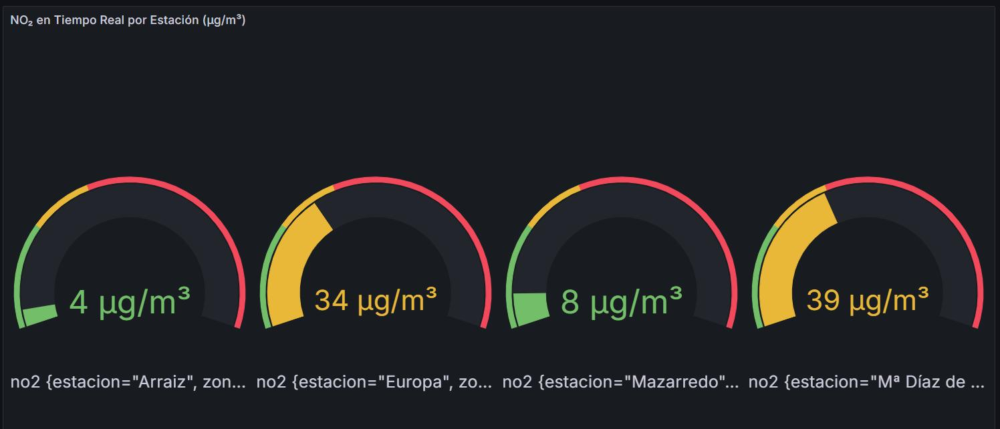
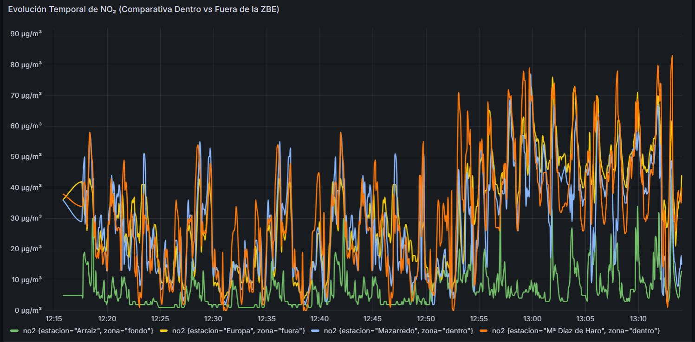
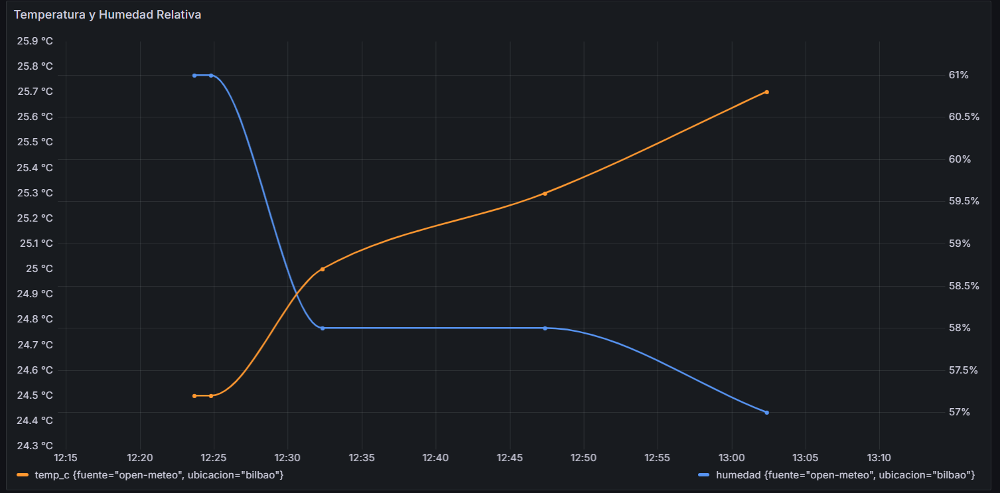
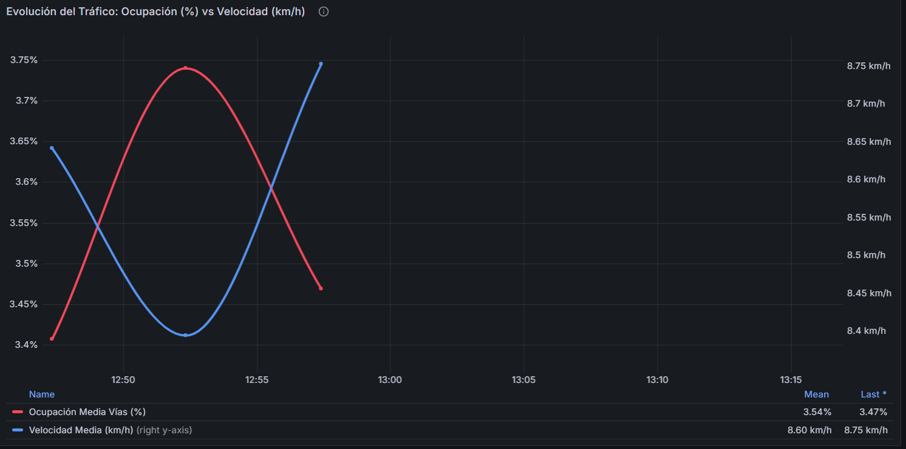
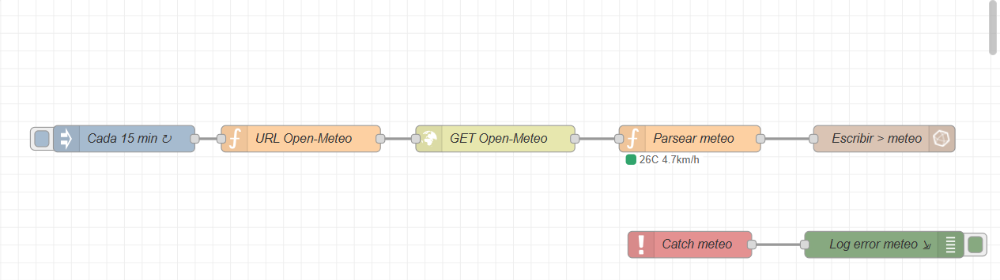
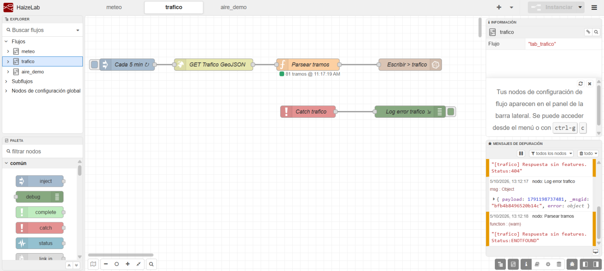
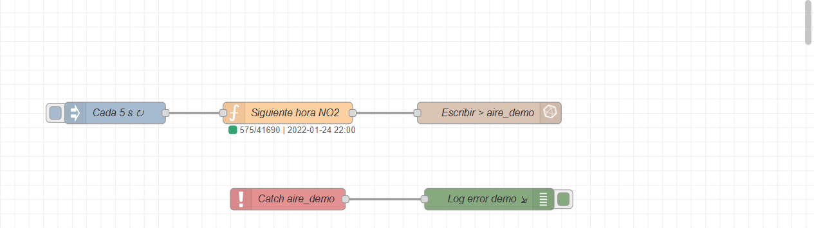
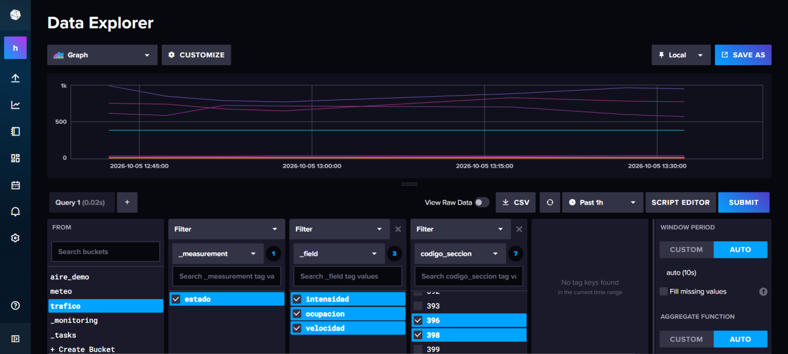
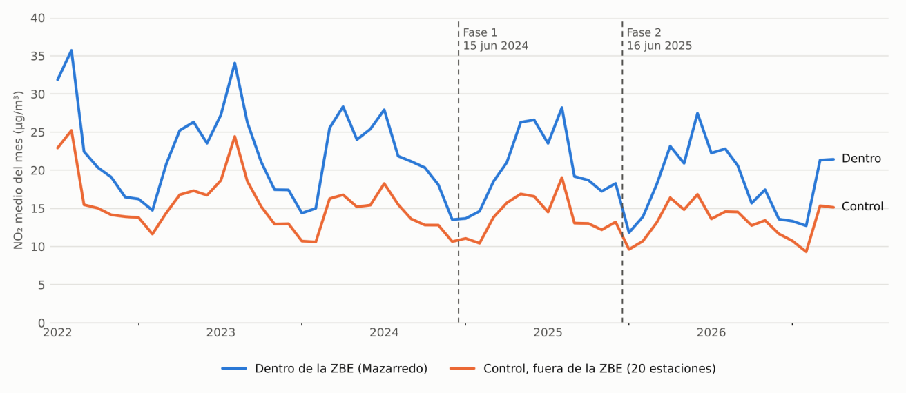

# HaizeLab — Monitorización y Análisis Multivariable de la ZBE de Bilbao

> **¿Ha mejorado el aire del centro de Bilbao con la Zona de Bajas Emisiones?**  
> Proyecto desarrollado por el equipo **Haizen Lab** (Iñigo, Kerman y Alfred) en el marco del **Reto 0** (*SBD · MIA · BDA · PIA*).

---

## 📌 Resumen Ejecutivo y Objetivos

La **Zona de Bajas Emisiones (ZBE) de Bilbao** entró en vigor en el distrito de Abando (~2 km²) el 15 de junio de 2024 (Fase 1: sin etiqueta DGT) y el 16 de junio de 2025 (Fase 2: sin etiqueta B para no residentes), aplicándose de lunes a viernes de 7:00 a 20:00.

Este repositorio combina dos capas complementarias:
1. **Infraestructura de Datos en Tiempo Real (IoT / TSDB)**: Ingesta continua con **Node-RED**, almacenamiento en base de datos temporal **InfluxDB 2.9** y visualización interactiva con control de acceso en **Grafana 11.2**.
2. **Pipeline de Análisis Estadístico y Modelado Científico**: Desestacionalización meteorológica (*deweathering* con Monte Banderas), modelo cuasi-experimental *Difference-in-Differences* (Diff-in-Diff) y contraste causal con aforos de tráfico de la Diputación Foral de Bizkaia.

---

## 🏗️ Arquitectura del Sistema

```
                  ┌──────────────────────────────────────────────┐
                  │                 FUENTES                      │
                  └───────┬──────────────┬──────────────┬────────┘
                          │              │              │
                    Open-Meteo API   Bilbao Open Data  Histórico NO₂
                    (cada 15 min)     (cada 5 min)     (Demo acelerada)
                          │              │              │
                          ▼              ▼              ▼
                  ┌──────────────────────────────────────────────┐
                  │                   Node-RED                   │
                  │             (http://localhost:1880)          │
                  │   Pestañas: [meteo]  [trafico]  [aire_demo]  │
                  └──────────────────────┬───────────────────────┘
                                         │  Token: nodered-write
                                         ▼
                  ┌──────────────────────────────────────────────┐
                  │                  InfluxDB 2                  │
                  │             (http://localhost:8086)          │
                  │   Buckets: aire · meteo · trafico · aire_demo│
                  └──────────────────────┬───────────────────────┘
                                         │  Token: read-all
                                         ▼
                  ┌──────────────────────────────────────────────┐
                  │                   Grafana                    │
                  │             (http://localhost:3000)          │
                  │   Dashboards, Alertas y Control de Acceso    │
                  └──────────────────────────────────────────────┘
```


---

## 🧭 Estructura Completa del Repositorio

```
haizelab/
├── data/
│   └── clean/                         # Datasets limpios para pipeline SBD
│       ├── calendario_zbe_limpio.csv  # Calendario laboral y festivos Bilbao
│       ├── inventario_calidad.csv     # Inventario y calidad de estaciones
│       └── meteorologia_limpia.csv    # Serie meteorológica unificada
│
├── datos/
│   ├── crudo/                         # Datos brutos originales (excluidos de git por peso)
│   └── procesados/                    # Datasets procesados y listos para análisis
│       ├── calidad_aire/
│       │   ├── comparacion_zonas_periodos.csv
│       │   ├── inventario_estaciones.csv
│       │   └── no2_horario_limpio.zip # Histórico NO2 comprimido (< 10 MB)
│       ├── meteorologia/
│       │   ├── meteo_bilbao_horario.csv
│       │   └── resumen_meteo_periodos.csv
│       ├── trafico/
│       │   ├── resumen_trafico_zbe.csv
│       │   ├── trafico_accesos_bilbao.csv
│       │   └── trafico_circunvalacion.csv
│       └── unificados/
│           ├── analisis_diff_in_diff.csv
│           ├── analisis_estratificado_viento.csv
│           ├── dataset_unificado_horario.csv
│           └── sintesis_ejecutiva_zbe.csv
│
├── docs/                              # Documentación técnica y diagramas
│   ├── img/                           # Capturas y gráficas del proyecto
│   ├── infraestructura-explicada.md   # Justificación técnica de InfluxDB y Node-RED
│   └── organigrama-datos.md           # Esquema org -> buckets -> measurements -> tags/fields
│
├── grafana/                           # Servicio de cuadros de mando
│   ├── dashboards/
│   │   └── haizelab-overview.json     # Dashboard auto-provisionado ZBE Bilbao
│   ├── provisioning/
│   │   ├── access-control/setup-access.sh # Configuración API de equipos y permisos
│   │   ├── alerting/alerting.yaml     # Reglas de alerta oficiales OMS y UE
│   │   └── dashboards/dashboards.yaml # Provider automático de dashboards
│   └── entrypoint.sh                  # Inyección de token read-all y auto-configuración
│
├── influxdb/                          # Base de datos de series temporales
│   └── init-influxdb.sh               # Creación de buckets y 3 tokens con mínimo privilegio
│
├── ingesta/                           # Carga y reproducción de datos
│   ├── carga_historica.py             # Script de carga batch a InfluxDB (NO2 y meteo)
│   ├── descargar_y_limpiar.py         # Pipeline de adquisición y limpieza SBD
│   └── no2_demo_reducido.csv          # Muestra histórica para reproducción en tiempo real
│
├── nodered/                           # Orquestador de flujos IoT
│   ├── Dockerfile                     # Imagen con node-red-contrib-influxdb
│   ├── entrypoint.sh                  # Inyección de tokens en runtime sin pasar por git
│   ├── flows.json                     # Flujos declarativos (meteo, tráfico, demo)
│   └── settings.js                    # Configuración de runtime
│
├── notebooks/                         # Análisis reproducible interactivo
│   └── zbe_bilbao.ipynb               # Jupyter Notebook de análisis multivariable SBD
│
├── salida/                            # Informes gráficos ejecutivos
│   ├── dashboard_decision_zbe.png     # Panel de decisión estratégica (4 cuadrantes)
│   └── evolucion_mensual_no2.png      # Gráfica de evolución mensual Dentro vs Fuera
│
├── scripts/                           # Módulos del análisis estadístico
│   ├── 01_extraer_calidad_aire.py     # Limpia y clasifica NO2 horario
│   ├── 02_extraer_meteorologia.py     # Limpia meteorología de Monte Banderas
│   ├── 03_extraer_trafico.py          # Extrae aforos desde las memorias PDF
│   ├── 04_unificar_datos.py           # Cruza aire + meteo + tráfico horario
│   ├── 05_analisis_impacto_zbe.py     # Modelo Diff-in-Diff y control por viento
│   ├── 06_visualizar_decision.py      # Genera paneles y gráficas de salida
│   └── generar_notebook.py            # Generador programático del notebook SBD
│
├── .env.example                       # Plantilla de variables de entorno segura
├── .gitattributes                     # Normalización estricta de finales de línea LF
├── .gitignore                         # Exclusiones de git (datos crudos, credenciales)
├── Dockerfile                         # Contenedor reproducible de análisis (Python 3.11)
├── docker-compose.yml                 # Orquestación multicontenedor completa
└── requirements.txt                   # Dependencias Python
```

---

## ⚡ Guía Rápida: Puesta en Marcha Desde Cero

Sigue estos pasos para levantar toda la infraestructura sin configurar nada manualmente:

### 1. Clonar el repositorio y situarse en `develop`
```bash
git clone https://github.com/ai-somorrostro/haizelab.git
cd haizelab
git checkout develop
```

### 2. Configurar las variables de entorno
Copia la plantilla `.env.example` como `.env`:
```bash
cp .env.example .env
```
*(Puedes dejar los valores por defecto para pruebas locales o cambiar contraseñas si lo deseas).*

### 3. Arrancar los contenedores
Ejecuta Docker Compose para construir y levantar los 4 servicios en segundo plano:
```bash
docker compose up -d --build
```

### 4. Verificar el estado de los servicios
Espera unos 30-45 segundos a que InfluxDB y Grafana terminen de inicializarse:
```bash
docker compose ps
```
Los cuatro servicios deben aparecer en estado `Up` / `healthy`:
* `haizelab_influxdb`: puerto `8086`
* `haizelab_influxdb_setup`: finalizado con código `0` (*exited 0*)
* `haizelab_nodered`: puerto `1880`
* `haizelab_grafana`: puerto `3000`

---

## 🖥️ Acceso a los Servicios y Credenciales

Todos los puertos están mapeados en `127.0.0.1` para evitar accesos indebidos desde la red local:

| Servicio | URL Local | Usuario / Acceso | Contraseña |
|---|---|---|---|
| **Grafana** | [http://localhost:3000](http://localhost:3000) | Anónimo (`Viewer`) o usuarios de equipo | Ver tabla de equipos abajo |
| **Node-RED** | [http://localhost:1880](http://localhost:1880) | Acceso directo a interfaz de flujos | — |
| **InfluxDB** | [http://localhost:8086](http://localhost:8086) | `admin` | Valor de `INFLUXDB_ADMIN_PASSWORD` en `.env` |

---

## 📊 Visualización en Grafana

El panel **«HaizeLab — Monitor ZBE Bilbao en Tiempo Real»** se abre de forma predeterminada al ingresar en [http://localhost:3000](http://localhost:3000).

Dispone de un selector de origen en la parte superior (`$bucket_aire`):
* **`aire_demo`** *(por defecto)*: Streaming en directo que reproduce una hora de datos cada 5 segundos.
* **`aire`**: Serie histórica completa oficial (2022–2026).

### Paneles Incluidos:

#### 1. Calidad del Aire (Relojes Semáforo y Serie Temporal)
Umbrales según normativa: Verde (< 25 µg/m³ recomendación diaria OMS), Amarillo (25–40 µg/m³ límite anual UE) y Rojo (> 40 µg/m³ superación).





#### 2. Meteorología en Tiempo Real (Open-Meteo Bilbao)
Temperatura, humedad relativa, velocidad de rachas de viento y precipitación acumulada en doble eje:



#### 3. Estado del Tráfico Urbano (Bilbao Open Data — 81 tramos)
Evolución de ocupación (%) frente a velocidad media (km/h) y ranking de los tramos con mayor congestión:



---

## 🔐 Control de Acceso y Roles en Grafana

Para cumplir los requisitos de seguridad y gobierno del dato, se han configurado 3 equipos con usuarios de demostración provisionados automáticamente:

| Equipo | Usuario | Contraseña | Rol | Permisos |
|---|---|---|---|---|
| **Público / General** | *(sin login)* | — | **Viewer** | Consulta los paneles sin permisos de edición ni borrado |
| **Cúpula Directiva** | `directora` | `haize2024dir` | **Viewer** | Visualización ejecutiva sin capacidad de modificar configuración |
| **Equipo Análisis** | `analista1` a `analista6` | `haize2024a1` .. `a6` | **Viewer** | Panel de análisis asignado como Home Dashboard |
| **Equipo IT** | `it_admin1` (`Admin`), `it_admin2` (`Editor`) | `haize2024it1` .. `it2` | **Admin / Editor** | Control total, edición de dashboards, gestión de alertas y datasources |

---

## 🔄 Flujos de Ingesta en Node-RED

En [http://localhost:1880](http://localhost:1880) se ejecutan de manera autónoma tres flujos independientes:

1. **`meteo` (cada 15 min)**: Consulta la API REST de Open-Meteo, extrae temperatura, viento, lluvia y humedad, y escribe en el bucket `meteo`.  
   

2. **`trafico` (cada 5 min)**: Consulta el servicio GeoJSON oficial de Bilbao Open Data (81 tramos), filtra campos válidos (evitando ceros falsos si un sensor no emite) y escribe en `trafico`.  
   

3. **`aire_demo` (cada 5 s)**: Emite en streaming acelerado los datos históricos reales de 4 estaciones estratégicas (Mazarredo, Mª Díaz de Haro, Europa y Arraiz).  
   

---

## 🗄️ InfluxDB 2: Esquema y Tokens de Mínimo Privilegio

Los buckets y tokens se aprovisionan en el primer arranque mediante el contenedor efímero `influxdb_setup`:



| Bucket | Retención | Contenido | Measurement |
|---|---|---|---|
| **`aire`** | Infinita | Serie histórica completa oficial de NO₂ (2022–2026) | `contaminantes` |
| **`meteo`** | Infinita | Meteorología histórica horaria y lecturas en vivo | `clima` |
| **`trafico`** | 30 días | Intensidad, ocupación y velocidad de 81 tramos urbanos | `estado` |
| **`aire_demo`** | 7 días | Reproducción acelerada para presentación en vivo | `contaminantes` |

### Tokens con Principio de Mínimo Privilegio:
* **`nodered-write`**: Solo puede escribir en `meteo`, `trafico` y `aire_demo`. Tiene prohibido escribir o borrar en `aire`.
* **`batch-write`**: Permiso exclusivo de escritura en `aire` y `meteo` para el script Python de carga histórica.
* **`read-all`**: Lectura estricta sobre los 4 buckets (utilizado por Grafana y futuros agentes MCP).
* **`admin`**: Utilizado únicamente durante el setup inicial; nunca se almacena en ficheros versionados en git.

---

## 📥 Carga Histórica Masiva en InfluxDB (Opcional)

Si deseas volcar los más de **2 millones de registros horarios históricos (2022–2026)** directamente en InfluxDB:

```bash
# Modo prueba sin escribir en la base de datos:
python ingesta/carga_historica.py --dry-run

# Carga real de NO2 y meteorología:
python ingesta/carga_historica.py --bucket all
```
El script lee los datos en bloques optimizados de 50.000 filas directamente desde el fichero comprimido sin saturar la memoria RAM.

---

## 🔬 Pipeline de Análisis Científico y Notebooks

### Opción A: Ejecución con Docker (Sin instalar Python local)
```bash
# Pipeline de adquisición y limpieza SBD
docker compose run --rm sbd-pipeline

# Ejecutar el Jupyter Notebook completo y actualizar salidas
docker compose run --rm sbd-notebook

# Ejecutar los pasos analíticos modulares
docker compose run --rm extraer
docker compose run --rm analisis
docker compose run --rm visualizar
```

### Opción B: Ejecución en Entorno Local
Instala dependencias:
```bash
pip install -r requirements.txt
```

Ejecuta el pipeline modular de análisis:
```bash
# 4. Cruzar datos horarios de aire, clima y tráfico
python scripts/04_unificar_datos.py

# 5. Modelo estadístico Diff-in-Diff y control por régimen de viento
python scripts/05_analisis_impacto_zbe.py

# 6. Generar gráficos y panel ejecutivo de decisión
python scripts/06_visualizar_decision.py
```
*(Nota: Los scripts `01`, `02` y `03` son extractores ETL a partir de las fuentes crudas originales. Al no incluirse los ficheros brutos de cientos de MB en git, los scripts `04` a `06` consumen directamente los datasets ya limpios y validados en `datos/procesados/`).*

---

## 📈 Resultados del Análisis y Toma de Decisión

El panel ejecutivo generado en `salida/dashboard_decision_zbe.png` resume las evidencias empíricas:




### Indicadores Clave de Evaluación:
1. **Calidad del Aire (NO₂)**:
   * **Dentro de la ZBE** (Mazarredo + Mª Díaz de Haro): descendió de **25,6 µg/m³** a **21,2 µg/m³** (**-17 %**).
   * **Control Urbano Exterior** (estaciones del Gran Bilbao): descendió de **15,9 µg/m³** a **13,4 µg/m³** (**-16 %**).
   * **Efecto Neto Diferencias en Diferencias (Diff-in-Diff)**: Reducción adicional en el interior de **-1,28 µg/m³** (IC 95 %: ±1,29).
2. **Control por Régimen de Viento (Monte Banderas)**:
   * En calma atmosférica (< 2 m/s), donde no hay dispersión y predominan las emisiones locales del centro, el NO₂ interior se redujo un **-20,5 %** (30,6 -> 24,3 µg/m³).
3. **Causalidad por Tráfico (Aforos Oficiales)**:
   * El acceso principal a la ZBE (**San Mamés**) experimentó una caída del **-10,12 %** (-5.075 vehículos diarios) tras la entrada en vigor de la zona restringida.

---

## 🛠️ Comandos de Administración de Docker

```bash
# Ver logs en tiempo real de Node-RED o Grafana
docker compose logs -f nodered
docker compose logs -f grafana

# Reiniciar servicios sin perder mediciones
docker compose restart

# Detener los contenedores preservando los datos
docker compose down

# Borrar TODO desde cero (incluyendo volúmenes y mediciones de InfluxDB)
docker compose down -v
```
