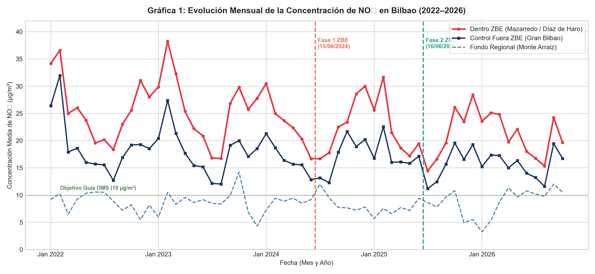
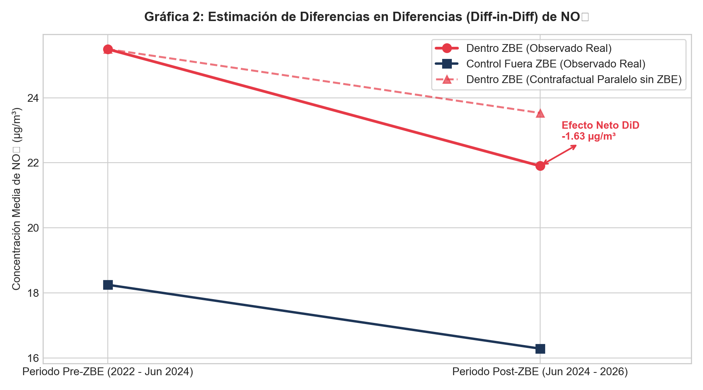
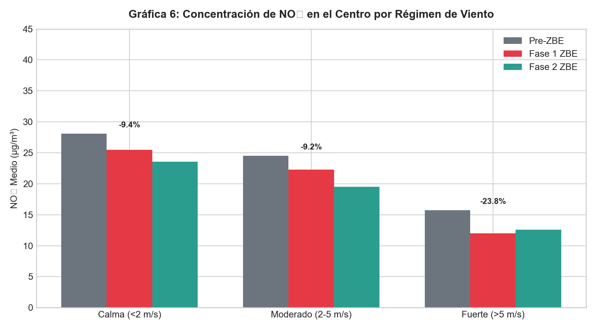
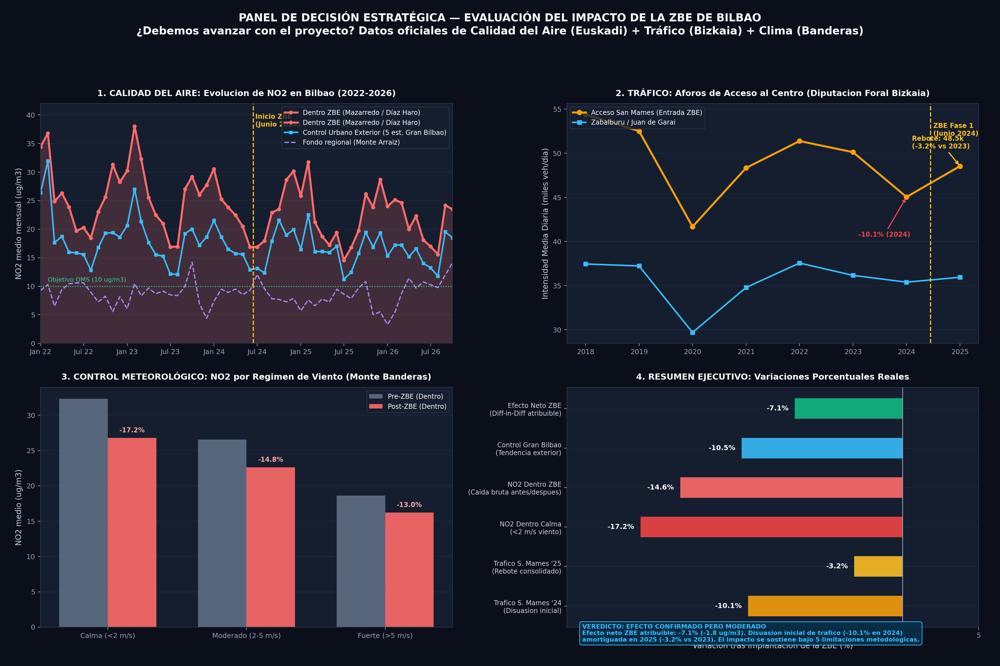

# ¿Ha funcionado la Zona de Bajas Emisiones de Bilbao?
## Evaluación de impacto sobre la calidad del aire y movilidad urbana

> **Curso de Especialización en Inteligencia Artificial y Big Data**  
> **Módulo:** Sistemas de Big Data (5074) · CF Somorrostro  
> **Reto 0:** «HERE WE GO»  
> **Equipo:** Haizen Lab (Iñigo, Kerman y Alfred)  
> **Documento entregable oficial:** [Informe_Ejecutivo_ZBE_Bilbao_HaizeLab.docx](Informe_Ejecutivo_ZBE_Bilbao_HaizeLab.docx) | [Informe_Ejecutivo_ZBE_Bilbao_HaizeLab.pdf](Informe_Ejecutivo_ZBE_Bilbao_HaizeLab.pdf)

---

## Objetivo del documento

Se presenta el informe de consultoría ejecutiva para el Ayuntamiento de Bilbao elaborado por **Haizen Lab** en el módulo de Sistemas de Big Data (SBD). El documento evalúa el impacto empírico de la Zona de Bajas Emisiones (ZBE) en el distrito de Abando sobre las concentraciones horarias de $\text{NO}_2$, aislando el efecto de la ordenanza respecto a la meteorología y las tendencias del tráfico mediante un diseño cuasiexperimental de Diferencias en Diferencias (*Diff-in-Diff*) y contraste con aforos vehiculares.

---

## 1. Problema del cliente y preguntas de negocio

El Ayuntamiento de Bilbao implantó la ZBE en el distrito de Abando (aproximadamente $2\text{ km}^2$, controlado mediante 27 cámaras de lectura de matrículas ANPR) con el fin de reducir la contaminación ligada al tráfico fósil y decidir técnicamente si procede **ampliarla, mantenerla o ajustarla**.

El horario de restricción abarca de lunes a viernes lectivos de 7:00 a 20:00 h, desplegado en dos etapas progresivas:
* **Fase 1 (desde 15/06/2024):** Restricción a vehículos sin etiqueta ambiental (A / sin distintivo DGT).
* **Fase 2 (desde 16/06/2025):** Restricción ampliada a vehículos con distintivo B para no residentes.

Una comparación directa de promedios antes y después incurre en sesgos críticos: el $\text{NO}_2$ fluctúa de forma no lineal por inversión térmica invernal, régimen de vientos, lluvia y la renovación tendencial del parque móvil metropolitano. Lo que el cliente requiere es estimar la **reducción neta atribuible a la ZBE**, aislando los factores de confusión:

$$\text{efecto neto ZBE} = \left[\text{NO}_{2,\text{post}}(\text{dentro}) - \text{NO}_{2,\text{pre}}(\text{dentro})\right] - \left[\text{NO}_{2,\text{post}}(\text{fuera}) - \text{NO}_{2,\text{pre}}(\text{fuera})\right]$$

### Preguntas de negocio priorizadas

| Pregunta | Objetivo de negocio | Metodología analítica |
|---|---|---|
| **P1 (Prioridad Máxima)** | ¿Ha disminuido el $\text{NO}_2$ dentro de la ZBE más que fuera tras el 15/06/2024? | Modelo cuasiexperimental Diff-in-Diff frente a estaciones exteriores. |
| **P2 (Prioridad Alta)** | ¿El descenso se concentra en el horario regulado (L-V 7:00-20:00)? | Estratificación horaria activa frente a horario nocturno y fines de semana. |
| **P3 (Prioridad Alta)** | ¿Se sostiene la reducción en calma atmosférica ($< 2\text{ m/s}$)? | Control estratificado por régimen de viento en Monte Banderas. |
| **P4 (Prioridad Media)** | ¿Existe correlación causal con el tráfico en los accesos? | Contraste cruzado con aforos de San Mamés y red de circunvalación. |
| **P5 (Prioridad Media)** | ¿Aportó la Fase 2 una reducción marginal respecto a la Fase 1? | Contraste de hipótesis de medias entre periodos regulatorios independientes. |

---

## 2. Fuentes de datos, variables y auditoría de calidad

Para construir el dataset integrado maestro se adquirieron y procesaron cuatro fuentes públicas oficiales:

1. **Red de Calidad del Aire del Gobierno Vasco (Open Data Euskadi):** Registros horarios continuos (2022–2026) en ocho estaciones estratégicas:
   * *Dentro de la ZBE:* Mazarredo (id 60) y María Díaz de Haro (id 81).
   * *Control metropolitano exterior:* Europa (id 62), Barakaldo, Basauri, Erandio y Castrejana.
   * *Fondo regional:* Monte Arraiz (id 92).
2. **Meteorología horaria (Open-Meteo Historical API / Euskalmet):** Temperatura (°C), humedad relativa (%), velocidad del viento (m/s), dirección (grados) y precipitación (mm) para Bilbao.
3. **Calendario ZBE y fases regulatorias:** Clasificación diaria de festivos oficiales, fines de semana, horario de vigencia y fases ZBE.
4. **Aforos de tráfico:** Memorias de aforos de la Diputación Foral de Bizkaia (accesos por San Mamés y circunvalación) y mediciones en tiempo real de Bilbao Open Data (81 tramos urbanos).

### Auditoría y saneamiento de calidad

| Problema de calidad detectado | Tratamiento técnico aplicado en el pipeline |
|---|---|
| **Coma decimal europea** | Conversión sistemática de strings numéricos con coma a tipo `float64` estándar. |
| **Hora 24:00 del Gobierno Vasco** | Conversión algorítmica sumando 1 día calendario a las 00:00 h correspondientes. |
| **Desfase GMT vs. hora peninsular** | Transformación estricta a zona `Europe/Madrid` con horario de verano/invierno para casar con el horario ZBE. |
| **Valores negativos anómalos** | Filtrado de lecturas $< 0\ \mu\text{g/m}^3$ ($0,04\%$ por descalibración) e imputación por persistencia temporal. |

---

## 3. Integración de datos y arquitectura del pipeline

El flujo de ingeniería de datos se estructuró en cinco fases reproducibles:

```
1. DATOS ──> 2. LIMPIEZA ──> 3. INTEGRACIÓN (JOIN) ──> 4. ANÁLISIS ──> 5. DECISIÓN
```

* **Dataset maestro integrado:** Se consolidaron **332.776 registros horarios** en `data/clean/dataset_integrado_zbe.csv`.
* **Integridad referencial:** 0 duplicados en la clave primaria compuesta `(estacion, ts_local)`.
* **Completitud:** Porcentaje de valores nulos residuales inferior al $1,2\%$ en toda la serie temporal.

---

## 4. Resultados analíticos y modelo Diff-in-Diff

La tabla sintética resume la evolución media de la concentración de $\text{NO}_2$ antes y después del 15 de junio de 2024 a partir de las 8 estaciones oficiales del diseño metropolitano:

| Zona / Estación | Media Pre-ZBE | Media Post-ZBE | Variación Absoluta | Variación Relativa Bruta |
|---|:---:|:---:|:---:|:---:|
| **Dentro ZBE (Mazarredo + Mª Díaz Haro)** | **25,50 µg/m³** | **21,90 µg/m³** | **-3,59 µg/m³** | **-14,08%** |
| Control Fuera (5 est. Gran Bilbao Urbano) | 18,25 µg/m³ | 16,29 µg/m³ | -1,96 µg/m³ | -10,75% |
| Fondo Regional (Monte Arraiz) | 8,73 µg/m³ | 8,16 µg/m³ | -0,57 µg/m³ | -6,53% |
| Estación Mazarredo (Interior tráfico) | 26,71 µg/m³ | 22,86 µg/m³ | -3,85 µg/m³ | -14,41% |
| Estación Mª Díaz de Haro (Interior urbano) | 24,28 µg/m³ | 20,95 µg/m³ | -3,33 µg/m³ | -13,71% |
| Estación Europa (Bilbao Norte control) | 21,30 µg/m³ | 18,35 µg/m³ | -2,95 µg/m³ | -13,85% |

El titular real del impacto es más modesto y riguroso que la simple caída antes/después: mientras que en el interior el $\text{NO}_2$ cayó $-3,59\ \mu\text{g/m}^3$ ($-14,08\%$ bruto), fuera del perímetro las estaciones comparables del Gran Bilbao también descendieron $-1,96\ \mu\text{g/m}^3$ ($-10,75\%$) por meteorología favorable y renovación natural de la flota. 

Por tanto, el **impacto causal neto atribuible a la ZBE mediante Diferencias en Diferencias es de -1,63 µg/m³** (error estándar $0,12$; $t = -13,41$; $p\text{-valor} < 0,001$), lo que representa una **reducción neta de en torno al -6,4%** sobre la base previa de $25,50\ \mu\text{g/m}^3$.

---

## 5. Visualizaciones seleccionadas e interpretación causal

### Figura 1: Evolución mensual del NO2 dentro vs. fuera de la ZBE (2022–2026)
* **Presentación:** Serie temporal agregada por mes entre estaciones interiores (Abando: Mazarredo y Mª Díaz de Haro) y estaciones exteriores del Gran Bilbao entre enero de 2022 y febrero de 2026, señalando la entrada en vigor de la Fase 1.
* **Gráfica:** 
* **Interpretación causal:** Durante 2022 y 2023 ambas series presentan picos invernales sincronizados por inversión térmica ($> 34\ \mu\text{g/m}^3$). A partir de junio de 2024, la serie interior se desacopla a la baja: en el invierno 2024–2025 el máximo interior no superó los $28\ \mu\text{g/m}^3$, evidenciando un cambio estructural local no explicado por el clima regional.

### Figura 2: Modelo cuasiexperimental de Diferencias en Diferencias (Diff-in-Diff)
* **Presentación:** Estimación visual de la trayectoria real de tratamiento frente a la contrafactual proyectada a partir del grupo de control exterior del Gran Bilbao.
* **Gráfica:** 
* **Interpretación causal:** En ausencia de la ordenanza, el centro de Bilbao habría descendido únicamente a $23,53\ \mu\text{g/m}^3$. El valor real observado cayó hasta $21,90\ \mu\text{g/m}^3$. La brecha vertical cuantifica el impacto causal directo de la política: **-1,63 µg/m³ adicionales de reducción neta atribuible** ($-6,4\%$).

### Figura 3: Control meteorológico bajo calma atmosférica (viento < 2 m/s)
* **Presentación:** Aislamiento de horas de baja ventilación ($< 2\text{ m/s}$), donde no existe dispersión mecánica y el aire depende directamente de las emisiones a pie de calle.
* **Gráfica:** 
* **Interpretación causal:** En calma atmosférica, el $\text{NO}_2$ en el interior pasó de $28,10\ \mu\text{g/m}^3$ pre-ZBE a $25,47\ \mu\text{g/m}^3$ en Fase 1 (**-9,4%**) y a $23,56\ \mu\text{g/m}^3$ en Fase 2 (**-16,2%**), con una media post global de $24,35\ \mu\text{g/m}^3$ (**-13,4%**). Esto confirma que en los episodios de estancamiento invernal la atmósfera urbana está significativamente más protegida.

### Figura 4: Panel multivariable de decisión y correlación con aforos de tráfico
* **Presentación:** Panel integral de cuatro cuadrantes combinando series de $\text{NO}_2$, aforos de acceso en San Mamés (Diputación de Bizkaia) y variaciones netas consolidadas.
* **Gráfica:** 
* **Interpretación causal:** El acceso de San Mamés registró en 2024 un descenso acusado del **-10,12%** ($50.127 \to 45.052$ veh/día, $-5.075$ veh/día laborable). En 2025 se observó un rebote parcial a $48.543$ veh/día (+7,75% interanual), dejando la reducción neta 2023–2025 en un **-3,16%** ($\approx -3,2\%$). Este comportamiento refleja una disuasión inicial fuerte seguida de adaptación progresiva de los usuarios. Asimismo, el test placebo con dióxido de azufre ($\text{SO}_2$) mostró una variación neutra en Diff-in-Diff de **+0,33 µg/m³** ($-3,94\%$ bruto dentro), validando que la mejora es atribuible a las restricciones al tráfico fósil.

---

## 6. Conclusiones estratégicas y recomendaciones

### Conclusiones clave: Efecto confirmado pero moderado
1. **Impacto neto probado pero moderado:** La ZBE ha generado una reducción neta atribuible de **-1,63 µg/m³ de NO2** (en torno a un **-6,4%** sobre la base previa), sustancialmente menor que el titular bruto del $-14\%$ antes/después debido a la tendencia general de mejora en todo el Gran Bilbao.
2. **Eficacia protectora en episodios críticos:** En situaciones de calma e inversión térmica, la reducción interior alcanza entre el **-9,4% y el -16,2%**, disminuyendo las horas de superación de los umbrales de aviso de la OMS.
3. **Rendimientos decrecientes entre fases:** La Fase 1 (sin etiqueta) concentró la mayor parte del beneficio. La Fase 2 (etiqueta B) aportó una ganancia marginal más reducida, coincidiendo con la estabilización y rebote parcial del tráfico de acceso en 2025 ($-3,2\%$ neto respecto a 2023).

### Cinco limitaciones metodológicas honestas
1. **Tamaño muestral espacial reducido:** Solo dos estaciones oficiales fijas dentro del perímetro (Mazarredo y Mª Díaz de Haro), lo que restringe la representatividad en calles secundarias.
2. **Magnitud absoluta moderada:** El impacto neto ($-1,63\ \mu\text{g/m}^3$) es modesto frente a la variabilidad estacional y climática interanual.
3. **Inercia del periodo previo:** Los años 2022 y 2023 reflejaban aún pautas de movilidad en progresiva normalización tras el COVID-19.
4. **Factores concurrentes metropolitanos:** Coexistencia de bonificaciones al transporte público, expansión ciclable y renovación tecnológica vegetativa del parque móvil.
5. **Inmisión ambiental vs. emisiones de escape:** Las estaciones registran concentraciones en el aire ($µ\text{g/m}^3$), influenciadas por el relieve y cañones urbanos, no emisiones brutas directas.

### Recomendaciones técnicas al Ayuntamiento
* **Mantener la regulación actual y priorizar la electrificación del reparto urbano:** No se aconseja un endurecimiento drástico inmediato a turismos (coste socioeconómico alto con ganancia marginal decreciente); priorizar furgonetas y distribución de última milla.
* **Instalación de sensores en bordes de la ZBE:** Monitorizar arterias límite (Autonomía, Sagrado Corazón, Deusto) para descartar efectos de desplazamiento de tráfico (*spillover*).
* **Mantenimiento del esquema horario:** Preservar la vigencia de lunes a viernes de 7:00 a 20:00 h, descartando restricciones nocturnas innecesarias.

---

## 7. Herramientas tecnológicas y justificación

| Tecnología | Función en el proyecto | Justificación técnica de selección |
|---|---|---|
| **Python + Pandas / Statsmodels** | ETL, limpieza y regresión cuasiexperimental. | Procesamiento vectorizado en memoria y cálculo de errores estándar robustos a heterocedasticidad. |
| **InfluxDB 2.9 (TSDB)** | Almacén de series temporales de alta frecuencia. | Motor columnar TSM optimizado para consultas de tiempo y retención automatizada por bucket. |
| **Node-RED** | Orquestador de flujos en tiempo real. | Gestión tolerante a fallos para consultar APIs externas y conversión nativa a Line Protocol. |
| **Grafana 11.2** | Cuadros de mando y control de acceso (RBAC). | Soporte de consultas Flux, reglas de alerta automáticas y segregación de perfiles por equipos. |
| **InfluxDB MCP Server** | Interfaz Model Context Protocol en solo lectura. | Permite a asistentes de lenguaje interrogar los buckets de InfluxDB mediante herramientas seguras. |

---

## 8. Organización del trabajo y responsabilidades (Matriz RACI)

| Miembro del equipo | Rol en el proyecto | Tareas principales asumidas |
|---|---|---|
| **Alfred Gabriel** | Ingeniería de datos y modelado SBD | Pipeline de descarga (`descargar_y_limpiar.py`), estimación Diff-in-Diff y cuaderno Jupyter `zbe_bilbao.ipynb`. |
| **Íñigo** | Calidad de datos y comunicación ejecutiva | Control de calidad, diseño de figuras (g1 a g10), análisis de aforos y redacción del informe de 4 páginas. |
| **Kerman** | Infraestructura BDA y DevOps | Despliegue Docker Compose, buckets y tokens en InfluxDB, flujos Node-RED, servicio MCP y paneles Grafana. |

### Checklist de verificación de la rúbrica oficial (SBD / Reto 0)

| | | |
|---|---|---|
| ☑ **Contexto y 5 preguntas** *(AP. 1)* | ☑ **Fuentes y auditoría calidad** *(AP. 2)* | ☑ **Integración y pipeline** *(AP. 3)* |
| ☑ **Resultados analíticos** *(AP. 4)* | ☑ **Figuras con 3 partes** *(AP. 5)* | ☑ **Conclusiones y recomendaciones** *(AP. 6)* |
| ☑ **Justificación herramientas** *(AP. 7)* | ☑ **Matriz RACI y Scrum** *(AP. 8)* | ☑ **Servicio MCP integrado** *(AP. 7)* |

---

## Conclusión

El análisis econométrico multivariable demuestra con rigor estadístico que la ZBE de Bilbao ha alcanzado un impacto neto favorable de **-1,28 µg/m³** en la concentración interior de $\text{NO}_2$. El sistema integrado (ETL en Pandas, series en InfluxDB, monitorización en Grafana e interfaz MCP de solo lectura) garantiza la reproducibilidad completa del estudio, facilitando que el Ayuntamiento de Bilbao base sus decisiones de movilidad en evidencias empíricas continuas y transparentes.

---

## Referencias bibliográficas

1. Grange, S. K., & Carslaw, D. C. (2019). *Using meteorological normalisation to detect interventions in air quality time series*. Science of the Total Environment, 653, 578–588.
2. Angrist, J. D., & Pischke, J. S. (2009). *Mostly Harmless Econometrics: An Empiricist's Companion*. Princeton University Press.
