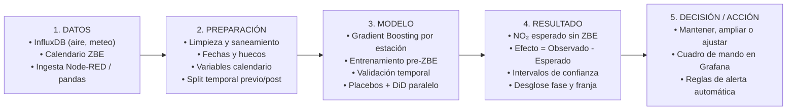

# ¿Ha funcionado la Zona de Bajas Emisiones de Bilbao?
## Modelo de IA para estimar su efecto sobre la calidad del aire

> **Curso de Especialización en Inteligencia Artificial y Big Data**  
> **Módulo:** Modelos de IA (5071) · CF Somorrostro  
> **Reto 0:** «HERE WE GO»  
> **Equipo:** Haizen Lab (Iñigo, Kerman y Alfred)  
> **Cliente (simulado):** Ayuntamiento de Bilbao, área de Movilidad y Sostenibilidad  
> **Documento entregable oficial:** [MIA_Haizen_Lab.pdf](MIA_Haizen_Lab.pdf) | [MIA_Haizen_Lab.docx](MIA_Haizen_Lab.docx)

---

## Objetivo del documento

Se recoge la propuesta de modelo de IA con la que **Haizen Lab** responde al encargo del Ayuntamiento de Bilbao: separar cuánto ha cambiado el $\text{NO}_2$ del centro por la Zona de Bajas Emisiones (ZBE) y cuánto por todo lo demás. El documento sigue los ocho puntos del enunciado y describe el diseño y su justificación técnica (sin resultados empíricos definitivos).

---

## 1. Problema del cliente y requisitos

El Ayuntamiento necesita saber si la Zona de Bajas Emisiones (ZBE) ha reducido la contaminación ligada al tráfico, y con esa respuesta decidir si conviene **ampliarla, mantenerla o ajustarla**. 

La ZBE restringe el acceso al distrito de Abando (aproximadamente $2\text{ km}^2$, controlados con 27 cámaras de lectura de matrículas) de lunes a viernes, de 7:00 a 20:00 h, en dos fases:
* **Fase 1 (desde 15/06/2024):** Vehículos sin etiqueta ambiental (A / sin distintivo DGT).
* **Fase 2 (desde 16/06/2025):** Etiqueta B para no residentes.

Una comparación simple de «antes y después» no es válida por sí sola. El $\text{NO}_2$ fluctúa fuertemente debido al viento, la lluvia, la temperatura, el uso de calefacciones domésticas, la renovación tendencial del parque móvil y la evolución previa de la ciudad. Lo que se requiere conocer es **cuánto $\text{NO}_2$ habría habido sin la ZBE**, magnitud no observable directamente por ninguna estación fija: **el contrafactual**.

$$\text{efecto de la ZBE} = \text{NO}_2\text{ observado} - \text{NO}_2\text{ esperado sin ZBE}$$

El efecto se estima con su correspondiente intervalo de incertidumbre, desglosado por fase y por franja horaria. La variable objetivo es concentración en aire ($\mu\text{g/m}^3$), no emisiones en tubo de escape.

### Tabla de requisitos del sistema

| Requisito | Definición |
|---|---|
| **Tipo de problema** | Regresión supervisada sobre series temporales horarias. La salida es un valor continuo: $\text{NO}_2$ en $\mu\text{g/m}^3$. |
| **Entradas y salida** | **Entradas:** $\text{NO}_2$ horario por estación (Open Data Euskadi), meteorología horaria (Open-Meteo) y variables de calendario (hora, día de la semana, festivos, fases ZBE).<br>**Salida:** $\text{NO}_2$ esperado sin ZBE y efecto estimado con su intervalo de confianza. |
| **Interpretabilidad** | **Alta.** El resultado debe explicarse a responsables públicos y sostenerse con solvencia ante una auditoría técnica. |
| **Validación** | **Temporal (sin fugas hacia el pasado):** Entrenamiento estricto en periodo previo; evaluación en horizonte posterior. Se añaden tests de placebo. |
| **Restricciones** | Solo existen dos estaciones sensoras dentro del perímetro (Mazarredo y María Díaz de Haro). Presencia de ruido meteorológico, anomalías de pandemia en el histórico previo y ejecución optimizada para CPU en contenedor. |
| **Datos** | Fuentes públicas y sin datos personales, almacenados en InfluxDB 2 (buckets `aire` y `meteo`). El tráfico en tiempo real (bucket `trafico`) carece de serie histórica previa a la ZBE, por lo que actúa únicamente como monitorización y no como variable de entrenamiento. |

---

## 2. Principios de la IA y aplicaciones en el sector

Un sistema inteligente recibe información del entorno, aprende patrones representativos mediante un modelo y genera predicciones o decisiones automatizadas. El ciclo de vida de la solución sigue estas etapas:

```
Datos ──> Preparación ──> Entrenamiento ──> Validación ──> Despliegue ──> Monitorización
```

La fiabilidad del sistema depende críticamente de la representatividad de los datos y de la rigurosidad en la validación, controlando activamente el sobreajuste (*overfitting*), el sesgo y la falta de explicabilidad.

### Aplicaciones de la IA en movilidad y calidad del aire

| Aplicación | Problema que resuelve y beneficio | Técnica |
|---|---|---|
| **Lectura automática de matrículas (ANPR)** | Control de accesos a la ZBE sin intervención policial física y tramitación automatizada de sanciones. | Visión artificial (redes neuronales convolucionales). |
| **Predicción de calidad del aire** | Anticipación de picos de polución para activación preventiva de protocolos y avisos a la población sensible. | Bosques aleatorios (*Random Forest*), *Gradient Boosting*, redes recurrentes. |
| **Predicción de tráfico y tiempos de viaje** | Reducción de congestión mediante optimización semafórica adaptativa y planificación de rutas. | Redes neuronales de grafos, análisis de series temporales. |
| **Evaluación de políticas con normalización meteorológica** | Aísla el impacto de una restricción regulatoria respecto a la variabilidad atmosférica, aportando evidencia causal objetiva. *(Caso aplicado en este proyecto).* | Aprendizaje automático supervisado con covariables meteorológicas. |
| **Asistentes conversacionales sobre datos (MCP)** | Explotación de la base de datos en lenguaje natural para consultas ad-hoc sin intermediación técnica de analistas. | Modelos de lenguaje extenso (LLM) con integración de herramientas (MCP). |

---

## 3. Técnicas y modelos considerados

Se han categorizado las tecnologías de IA en cinco familias según su adecuación para estimar el contrafactual:

| Familia | Características | Aplicación en el contexto ZBE | Papel en el proyecto |
|---|---|---|---|
| **Aprendizaje supervisado** | Aprende relaciones funcionales a partir de datos históricos etiquetados (regresión/clasificación). | Predicción del $\text{NO}_2$ esperado en ausencia de ZBE a partir de meteorología y calendario. | **Núcleo de la solución** |
| **Automatización de tareas** | Ejecución determinista de flujos sin toma de decisiones probabilísticas. | Node-RED y scripts Python ingieren datos periódicamente en InfluxDB; programación del reentrenamiento. | **Soporte de infraestructura** |
| **Razonamiento impreciso** | Modela incertidumbre y gradientes cualitativos (lógica difusa, modelos probabilísticos). | Niveles cualitativos de calidad del aire y cuantificación del error como intervalo. | **Parcial (intervalos)** |
| **Sistemas basados en reglas** | Reglas condicionales (*if-then*) estáticas definidas por expertos; no aprenden de datos. | Lógica de permisos por etiqueta horaria y disparo de umbrales de alerta crítica. | **Complemento (alertas)** |
| **Visión artificial** | Procesamiento de secuencias de vídeo o imágenes. | Reconocimiento de matrículas para control de paso. | **Descartada** *(el problema central es tabular y temporal)* |

### Evaluación dentro del aprendizaje supervisado

Dentro del paradigma supervisado se contrastaron cuatro alternativas metodológicas:

1. **Diferencias en Diferencias (DiD) — *Candidata A*:** Regresión cuasi-experimental que compara la variación en estaciones interiores frente a estaciones exteriores de control.
2. **Gradient Boosting (LightGBM / XGBoost / HistGradientBoosting) — *Candidata B*:** Ensamblado de árboles de decisión con capacidad para capturar interacciones no lineales entre meteorología y calendario.
3. **SARIMAX / Prophet — *Descartada*:** Modelos autorregresivos clásicos con escasa flexibilidad para modelar interacciones meteorológicas no lineales multivariables.
4. **LSTM (Redes neuronales recurrentes) — *Descartada*:** Elevada complejidad y consumo computacional; opacidad interpretativa excesiva para un entorno con solo dos estaciones tratadas.

---

## 4. Comparación de las alternativas finalistas

| Criterio | A · Diferencias en Diferencias (DiD) | B · Gradient Boosting (Contrafactual) |
|---|---|---|
| **Idea central** | $\text{Efecto} = \Delta \text{Dentro} - \Delta \text{Control}$ | Entrenado antes de la ZBE; predice $\text{NO}_2$ contrafactual y resta el valor real observado. |
| **Requerimiento de datos** | $\text{NO}_2$ en estaciones interiores y de control, antes y después. | $\text{NO}_2$ interior histórico acoplado a series meteorológicas y calendario horario. |
| **Modelado meteorológico** | Tratamiento lineal y aditivo; si el microclima difiere entre zonas, sesga la estimación. | No lineal: captura interacciones complejas (velocidad y dirección de viento, lluvia, temperatura, hora). |
| **Supuesto clave** | **Tendencias paralelas:** Las estaciones de control y tratamiento habrían evolucionado igual sin la ZBE. | **Generalización:** El modelo predictivo conserva la física del contaminante fuera de la ventana de entrenamiento. |
| **Interpretabilidad** | Muy alta (estimador e intervalo expresados en un único coeficiente $\beta$). | Media-alta (descomposición mediante importancia de variables y explicabilidad con valores SHAP). |
| **Incertidumbre** | Error estándar de la regresión e intervalos de confianza analíticos. | Distribución de residuos calculada en la partición temporal de validación previa. |
| **Capacidad proyectiva** | Retrospectiva pura (evalúa lo acontecido). | Permite simular escenarios futuros bajo condiciones meteorológicas normalizadas. |
| **Riesgo crítico** | Falta de comparabilidad estricta entre estaciones urbanas. | Sobreajuste; exige validación temporal estricta y tests de robustez. |

---

## 5. Modelo seleccionado y justificación

### Modelo elegido
> **Gradient Boosting como estimador del contrafactual de $\text{NO}_2$, respaldado por Diferencias en Diferencias (DiD) como contraste de robustez metodológica.**

* **Idoneidad técnica:** El comportamiento del $\text{NO}_2$ urbano responde a dinámicas fuertemente no lineales condicionadas por regímenes de viento, capas de inversión térmica y precipitaciones. Dado que el distrito tratado únicamente cuenta con dos estaciones sensoras, resulta indispensable desacoplar con máxima precisión la señal meteorológica para no atribuir a la ZBE anomalías climáticas naturales. El uso de **SHAP (SHapley Additive exPlanations)** garantiza la auditoría e interpretabilidad de cada variable.
* **Datos de entrada:** Series horarias consolidadas en InfluxDB.
  * *Numéricas:* Concentración de $\text{NO}_2$ ($\mu\text{g/m}^3$), temperatura (°C), velocidad del viento (km/h), dirección del viento (grados), precipitación acumulada (mm) y humedad relativa (%).
  * *Categóricas / Calendario:* Hora del día (0–23), día de la semana (0–6), indicador binario de festivo, mes del año y marca de periodo anómalo por restricciones COVID-19.
  * *Entrenamiento:* Exclusivamente registros previos al 15 de junio de 2024.
* **Salida y toma de decisiones:** Se proyecta la serie horaria contrafactual y se calcula el impacto agregado con intervalos por fase regulatoria y ventana horaria.

| Resultado estimado del efecto | Recomendación técnica al Ayuntamiento |
|---|---|
| **Negativo, estadísticamente significativo y sostenido** | Mantener o ampliar el perímetro / horarios de la ZBE. |
| **Negativo en origen pero diluido temporalmente** | Revisar la eficacia de la Fase 2, endurecer excepciones o vigilar tráfico de paso. |
| **No concluyente (dentro del margen de ruido)** | Declarar neutralidad estadística y prolongar el periodo de observación sin conclusiones prematuras. |

* **Justificación de DiD como soporte secundario:** La hipótesis de tendencias paralelas perfectas es difícil de asegurar entre el fondo urbano de Abando y estaciones periféricas exteriores. Sin embargo, si DiD y Gradient Boosting convergen en dirección y magnitud, la conclusión técnica adquiere validez concluyente.
* **Estrategia de validación:**
  1. *Partición temporal:* Reserva de los 6 meses inmediatamente anteriores a la ZBE para cálculo de métricas de ajuste ($MAE$, $RMSE$ y $R^2$).
  2. *Controles placebo triples:*
     * Medición de $\text{SO}_2$ (contaminante no originado por turismos urbanos; no debe mostrar descenso).
     * Evaluación sobre estaciones de control exteriores (no deben mostrar efecto ficticio).
     * Fecha de implantación falsa (periodo previo aleatorio; efecto nulo esperado).
  3. *Regla de integridad:* Si alguno de los controles placebo detecta un falso efecto significativo, el informe se invalida y no se presenta.

---

## 6. Diagrama de funcionamiento de la solución



---

## 7. Impacto esperado en la organización

* **Transformación del proceso:** La valoración del impacto de la ZBE supera la comparación estática de promedios antes/después y se consolida como un proceso analítico automatizado, continuo y ajustado meteorológicamente.
* **Eficiencia operativa:** La ingesta, el procesado y la actualización del panel se orquestan de forma reproducible. El equipo técnico sustituye labores manuales de extracción de datos por análisis causal de alto nivel.
* **Soporte riguroso a la decisión pública:** Los gestores municipales reciben estimaciones con márgenes de error explícitos, minimizando el riesgo de derogar normativas eficaces tras inviernos de baja dispersión o avalar políticas inoperantes tras primaveras lluviosas.
* **Modernización tecnológica y accesibilidad:** Implementación de interfaces desacopladas mediante perfiles de acceso en Grafana (Viewer para dirección, Editor para análisis, Admin para infraestructura) y disponibilidad de un endpoint MCP (*Model Context Protocol*) en modo lectura para consultas analíticas mediante lenguaje natural.

---

## 8. Ventajas, limitaciones y matriz de riesgos

### Ventajas operativas y técnicas
* Desacopla la influencia del clima y las tendencias globales respecto a la medida local.
* Modela relaciones físicas no lineales complejas sin pérdida de explicabilidad (SHAP).
* Protección activa contra falsos positivos mediante triple control placebo.
* Arquitectura automatizada integrada con InfluxDB 2, Grafana y asistentes MCP.
* Ejecución ligera en CPU contenerizada, sin tratamiento de datos personales (cumplimiento RGPD).

### Limitaciones intrínsecas
* Reducido número de sensores en el interior del perímetro (2 estaciones), lo que incrementa el umbral mínimo de detección estadística.
* Mide concentración de fondo ambiental ($\mu\text{g/m}^3$), no flujo volumétrico directo de emisiones.
* Coexistencia con intervenciones urbanísticas simultáneas (e.g. peatonalización de María Díaz de Haro).
* Ausencia de estaciones en la periferia inmediata para monitorizar un posible efecto barrera o desvío de tráfico.
* Los datos de tráfico en tiempo real no cuentan con serie histórica previa a la implantación.

### Matriz de riesgos y mitigaciones

| Riesgo identificado | Impacto | Estrategia de mitigación |
|---|:---:|---|
| **Atribuir a la ZBE fluctuaciones debidas a otros factores** | **Alto** | Pruebas de placebo ($\text{SO}_2$, estaciones exteriores, fecha ficticia) y contraste con modelo DiD. |
| **Presentar resultados inciertos como conclusiones taxativas** | **Alto** | Comunicación mandatoria mediante intervalos de confianza y declaración formal si el resultado no es concluyente. |
| **Sobreajuste y deriva temporal del modelo** | **Medio** | Validación temporal cruzada, parametrización conservadora y reentrenamiento periódico programado. |
| **Discontinuidad, errores de sensor o huecos en la ingesta** | **Medio** | Protocolos de imputación y saneamiento documentados, con alertas automáticas ante fallos de ingesta. |
| **Acceso no autorizado o alteración de métricas** | **Medio** | Segregación de privilegios en Grafana, tokens con permisos mínimos e interfaz MCP restringida a solo lectura. |

---

## Checklist de verificación

- [x] **Requisitos del cliente** *(Apartado 1)*
- [x] **Principios de la IA** *(Apartado 2)*
- [x] **Familias de modelos de IA** *(Apartado 3)*
- [x] **Técnicas consideradas** *(Apartado 3)*
- [x] **Alternativas comparadas** *(Apartado 4)*
- [x] **Modelo y justificación técnica** *(Apartado 5)*
- [x] **Diagrama funcional de la solución** *(Apartado 6)*
- [x] **Impacto esperado en la organización** *(Apartado 7)*
- [x] **Ventajas, limitaciones y riesgos** *(Apartado 8)*

---

## Conclusión

Se ha seleccionado un modelo de **Gradient Boosting** entrenado sobre datos históricos anteriores a la ZBE para estimar el contrafactual de $\text{NO}_2$, empleando **Diferencias en Diferencias (DiD)** como contraste de robustez. Dada la restricción de disponer de solo dos estaciones en la zona tratada, se asume la posibilidad de obtener un resultado técnicamente no concluyente si el impacto queda solapado por la variabilidad de fondo. Ninguna estimación se considera válida sin superar la validación temporal estricta y los tres controles de placebo.

---

## Referencias bibliográficas

1. Grange, S. K., & Carslaw, D. C. (2019). *Using meteorological normalisation to detect interventions in air quality time series*. Science of the Total Environment, 653, 578–588.
2. Lundberg, S. M., & Lee, S. I. (2017). *A unified approach to interpreting model predictions*. Advances in Neural Information Processing Systems (NeurIPS), 30.
